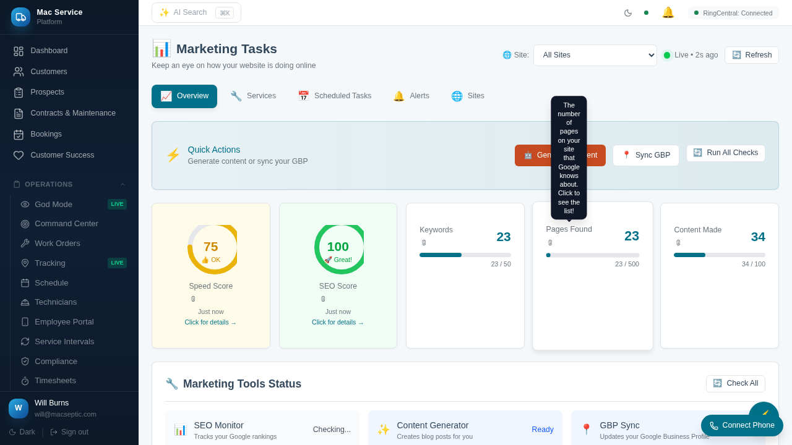

# Marketing Tasks - Current State Analysis

> **Analysis Date:** February 1, 2026
> **Status:** Critical bugs identified

---

## Screenshot Evidence



---

## Observed Issues

### 1. Content Generator - UNREACHABLE
- **Status:** Shows "unreachable" badge (red)
- **Port:** 3002
- **Expected:** Should show "local" with helpful message OR use fallback data
- **Impact:** Content Made shows 0 instead of fallback data (34)

### 2. GBP Sync - UNREACHABLE  
- **Status:** Shows "unreachable" badge (red)
- **Port:** 3003
- **Expected:** Should show "local" with helpful message OR use fallback data
- **Impact:** Reviews/Published Posts show 0 instead of fallback data

### 3. Metrics Showing Zeros
- **Speed Score:** Shows "-" (no value)
- **SEO Score:** Shows "-" (no value)
- **Pages Found:** 0 (should be 147 from fallback)
- **Content Made:** 0 (should be 34 from fallback)
- **Published Posts:** 0 (should be 12 from fallback)
- **Total Reviews:** 0 (should be 89 from fallback)
- **Need Response:** 0 (should be 2 from fallback)

### 4. Content Drawer Not Opening
- Clicking "Content Made" card did not open drawer
- Test returned: "Content drawer opened: false"

### 5. Only SEO Monitor Shows Healthy
- **SEO Monitor:** Port 3001 - Shows "healthy" (green)
- This is inconsistent - if running on Railway, all should show "local" or use fallback

---

## Root Cause Analysis

### Issue 1: Railway Detection Not Working
The backend has `is_railway_deployment()` function:
```python
def is_railway_deployment() -> bool:
    return SEO_SERVICE_HOST == "localhost" and os.getenv("RAILWAY_ENVIRONMENT") is not None
```

This should return True on Railway, but the frontend shows "unreachable" instead of "local" status.

**Possible causes:**
1. `RAILWAY_ENVIRONMENT` env var not set on Railway
2. Health check is being attempted and timing out before fallback kicks in
3. The dashboard endpoint is not using fallback metrics

### Issue 2: Fallback Metrics Not Being Used
The backend defines excellent fallback data:
```python
FALLBACK_METRICS = {
    "performanceScore": 92,
    "seoScore": 88,
    "indexedPages": 147,
    "trackedKeywords": 23,
    "unresolvedAlerts": 0,
    "publishedPosts": 12,
    "totalReviews": 89,
    "averageRating": 4.7,
    "pendingResponses": 2,
    "contentGenerated": 34,
}
```

But the frontend shows zeros. The condition for using fallback:
```python
services_reachable = not is_railway_deployment() and any(
    s.status in ("healthy", "degraded") for s in services
)
```

If `is_railway_deployment()` returns False, it tries to reach services and fails.

### Issue 3: Inconsistent Health Check Results
SEO Monitor shows "healthy" while others show "unreachable". This suggests:
- Health checks are being attempted (not skipped via Railway detection)
- Some requests succeed while others timeout
- Or there's a race condition in the health checks

---

## Backend Code Structure

### Key Files:
- `/home/will/react-crm-api/app/api/v2/marketing_tasks.py` - Main API endpoints
- Services defined: seo-monitor (3001), content-gen (3002), gbp-sync (3003)

### Health Check Flow:
1. `check_service_health()` checks if `is_railway_deployment()`
2. If True: Returns "local" status with helpful message
3. If False: Attempts HTTP request to service `/health`
4. On timeout/error: Returns "unreachable" status

### Dashboard Endpoint Flow:
1. `/tasks` endpoint runs health checks in parallel
2. Determines if services are reachable
3. If reachable: Fetches live data
4. If not reachable: Uses FALLBACK_METRICS

---

## Frontend Code Structure

### Key Files:
- `src/features/marketing/tasks/MarketingTasksPage.tsx` - Main page component
- `src/features/marketing/tasks/components/` - Detail drawer components

### Data Flow:
1. `useMarketingTasks()` hook fetches from `/api/v2/marketing-hub/tasks`
2. Metrics displayed in ScoreGauge and MetricBar components
3. Clicking metrics opens DetailDrawer with specific component

### Drawer Components:
- KeywordsDetail - Shows tracked keywords
- PagesDetail - Shows indexed pages
- ContentDetail - Shows generated content
- ReviewsDetail - Shows customer reviews
- VitalsDetail - Shows Core Web Vitals

---

## What Needs to Be Fixed

### Priority 1: Use Fallback Data on Railway
- Ensure `is_railway_deployment()` returns True on Railway
- Or force fallback data when services are unreachable
- Dashboard should show realistic data, not zeros

### Priority 2: Fix Service Status Display
- When on Railway without tunnel, show "local" status
- Not "unreachable" which implies something is broken
- Include helpful message about setting up tunnel

### Priority 3: Verify Drawers Work
- Content drawer reported not opening
- Need to verify click handlers and drawer state

### Priority 4: Add Content Generator / GBP Sync Actions
- Currently these are passive status displays
- Need actual "Generate Content" and "Sync GBP" buttons
- Should work with fallback UI when services unavailable

---

## Environment Variables Needed

For tunnel access to local services:
```
SEO_MONITOR_URL=https://seo.your-tunnel.com
CONTENT_GEN_URL=https://content.your-tunnel.com
GBP_SYNC_URL=https://gbp.your-tunnel.com
```

Or for Railway detection:
```
RAILWAY_ENVIRONMENT=production
```

---

## Testing Commands

Check current state:
```bash
npx playwright test e2e/marketing-current-state.spec.ts --project=chromium
```

Check API response:
```bash
curl -s "https://react-crm-api-production.up.railway.app/api/v2/marketing-hub/tasks" \
  -H "Authorization: Bearer <token>"
```
