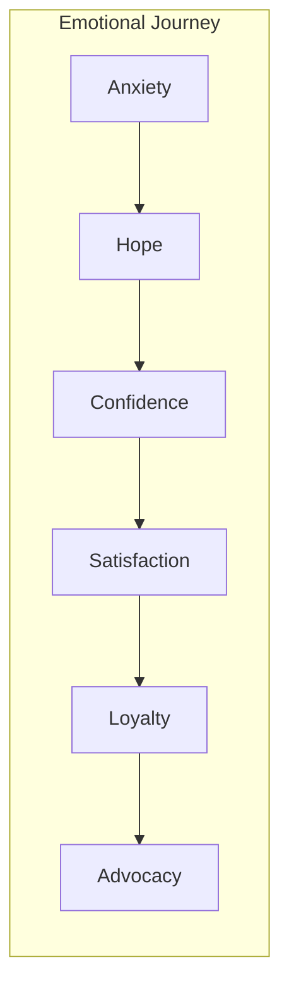
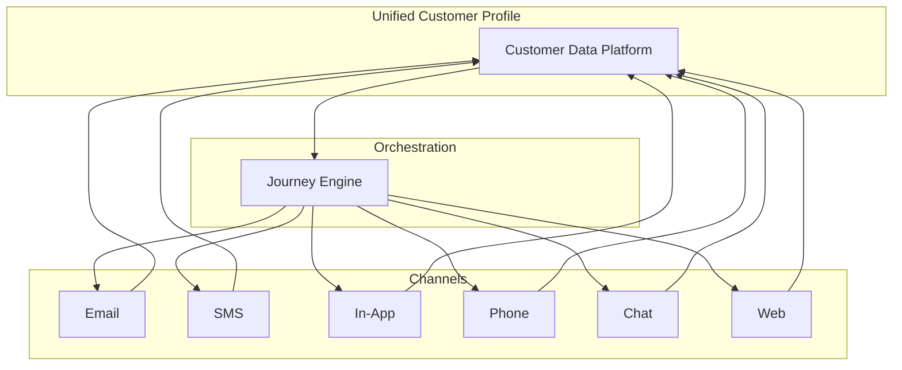

# Customer Journey Best Practices 2026

> **Research Synthesis** | **Updated:** January 2026
> **Sources:** Gartner, Forrester, NNGroup, McKinsey, industry leaders

---

## Executive Summary

The customer journey landscape in 2025-2026 has been transformed by three major forces:

1. **AI-Powered Orchestration** - Real-time decisioning and personalization at scale
2. **Unified Customer Experience** - Seamless omnichannel continuity
3. **Proactive Engagement** - Predictive interventions before issues arise

Organizations implementing these practices see:

- 30-50% improvement in customer satisfaction
- 25-40% reduction in churn
- 20-35% increase in expansion revenue
- 40-60% reduction in time-to-value

---

## Key Trends & Insights

### 1. AI-Powered Journey Orchestration

**The Shift:** From rule-based automation to intelligent orchestration

**What's Changed:**

- Real-time decision engines replace static workflow rules
- Machine learning models predict optimal next actions
- Natural language AI enables personalization at scale
- Agentic AI handles routine customer interactions autonomously

**Best Practices:**

| Practice                | Impact          | Implementation                               |
| ----------------------- | --------------- | -------------------------------------------- |
| Next-Best-Action AI     | +35% engagement | Deploy ML models for action recommendation   |
| Send Time Optimization  | +25% open rates | AI-optimized delivery timing per customer    |
| Churn Prediction        | -30% churn      | Early warning models with 60-90 day horizon  |
| Content Personalization | +40% conversion | Dynamic content based on customer attributes |

**Key Technologies (2025-2026):**

- Salesforce Agentforce / Einstein GPT
- Adobe Journey Optimizer AI
- Braze Sage AI
- MoEngage Sherpa
- Custom ML pipelines

**Implementation Framework:**

```
Level 1: Rule-Based (Baseline)
├── Static triggers and conditions
├── Time-based sequences
└── Manual segmentation

Level 2: Predictive (Intermediate)
├── ML-powered scoring
├── Propensity models
└── Dynamic segmentation

Level 3: Intelligent (Advanced)
├── Real-time decisioning
├── Next-best-action AI
├── Autonomous agents

Level 4: Adaptive (Leading Edge)
├── Self-optimizing journeys
├── Cross-journey intelligence
└── Continuous learning loops
```

---

### 2. Emotional Journey Mapping

**The Shift:** From functional touchpoints to emotional experiences

**Research Insight (Forrester 2025):**

> "Emotion is the #1 driver of customer loyalty, outweighing ease and effectiveness by 1.5x"

**Emotional Mapping Framework:**



**Best Practices:**

| Emotion Stage    | Customer State      | Design Goal                             |
| ---------------- | ------------------- | --------------------------------------- |
| **Anxiety**      | Uncertain, worried  | Reduce friction, provide clarity        |
| **Hope**         | Optimistic, curious | Build excitement, show value            |
| **Confidence**   | Trusting, engaged   | Reinforce decisions, celebrate progress |
| **Satisfaction** | Content, validated  | Exceed expectations, surprise           |
| **Loyalty**      | Committed, habitual | Reward consistency, deepen relationship |
| **Advocacy**     | Enthusiastic, proud | Enable sharing, recognize contribution  |

**Emotional Touchpoint Design:**

```yaml
touchpoint_design:
  identify_emotion:
    - What is the customer likely feeling at this moment?
    - What triggered this emotional state?

  design_response:
    - How should we acknowledge this emotion?
    - What action reduces negative or amplifies positive emotion?

  measure_impact:
    - Customer sentiment score
    - Behavioral indicators
    - Qualitative feedback
```

---

### 3. Omnichannel Continuity

**The Shift:** From multichannel presence to unified experience

**Key Insight (McKinsey 2025):**

> "Customers expect 100% context continuity. 73% will switch providers after a single 'cold handoff' experience."

**Continuity Framework:**

| Dimension        | Poor Practice             | Best Practice          |
| ---------------- | ------------------------- | ---------------------- |
| **Context**      | Customer repeats info     | Full history available |
| **Conversation** | Starts fresh each channel | Continues seamlessly   |
| **Progress**     | Lost between touchpoints  | Tracked and visible    |
| **Preference**   | Ignored                   | Respected and learned  |
| **Timing**       | Arbitrary                 | Optimized per customer |

**Channel Integration Architecture:**



**Best Practices:**

1. **Single Customer View**
   - Unified profile across all systems
   - Real-time data synchronization
   - Identity resolution across channels

2. **Channel Orchestration**
   - Respect channel preferences
   - Intelligent channel selection
   - Graceful fallback chains

3. **Conversation Memory**
   - Track all interactions
   - Surface relevant context
   - Enable human agents seamlessly

---

### 4. Proactive Customer Success

**The Shift:** From reactive support to proactive engagement

**Research (Gartner 2025):**

> "Proactive outreach reduces customer effort by 35% and increases retention by 25%"

**Proactive Engagement Matrix:**

| Signal               | Timing         | Intervention                |
| -------------------- | -------------- | --------------------------- |
| Usage drop           | 7-day trend    | Check-in email + usage tips |
| Feature struggle     | Real-time      | In-app guidance             |
| Contract approaching | 90 days out    | Renewal conversation        |
| Health score decline | Immediate      | CSM alert + outreach        |
| Payment issue        | Before impact  | Proactive billing support   |
| Success milestone    | On achievement | Celebration + next steps    |

**Health Score Components (2026 Standard):**

```yaml
health_score_model:
  engagement:
    weight: 0.30
    signals:
      - login_frequency
      - feature_adoption
      - time_in_product
      - support_ticket_sentiment

  value_realization:
    weight: 0.25
    signals:
      - goals_achieved
      - roi_metrics
      - success_milestones

  relationship:
    weight: 0.20
    signals:
      - nps_score
      - survey_responses
      - csm_interaction_quality

  growth_potential:
    weight: 0.15
    signals:
      - expansion_signals
      - usage_vs_entitlement
      - advocacy_actions

  risk_factors:
    weight: 0.10
    signals:
      - payment_history
      - escalations
      - competitor_mentions
```

---

### 5. Journey Metrics & Analytics

**The Shift:** From vanity metrics to outcome-based measurement

**Metrics Framework 2026:**

| Category         | Metric                | Target    | Measurement                   |
| ---------------- | --------------------- | --------- | ----------------------------- |
| **Speed**        | Time-to-Value         | < 7 days  | First value milestone         |
| **Engagement**   | DAU/MAU Ratio         | > 40%     | Daily active / Monthly active |
| **Health**       | Customer Health Score | > 70      | Composite scoring model       |
| **Satisfaction** | NPS                   | > 50      | Net Promoter Score            |
| **Effort**       | CES                   | > 4.0/5.0 | Customer Effort Score         |
| **Retention**    | Net Revenue Retention | > 110%    | Expansion - Churn             |
| **Efficiency**   | FTFR                  | > 80%     | First Time Fix Rate           |

**Journey-Specific Metrics:**

```yaml
journey_metrics:
  enrollment:
    - entry_rate: "% of eligible customers enrolled"
    - entry_source: "Distribution by trigger type"

  progression:
    - completion_rate: "% completing all stages"
    - stage_conversion: "% advancing per stage"
    - drop_off_points: "Where customers exit"
    - time_in_stage: "Average duration per stage"

  engagement:
    - touchpoint_response: "Open, click, reply rates"
    - channel_effectiveness: "Performance by channel"
    - content_performance: "Which messages resonate"

  outcomes:
    - goal_achievement: "% achieving journey goal"
    - behavioral_change: "Pre vs post behavior"
    - revenue_impact: "ARR influenced by journey"
```

---

### 6. Personalization at Scale

**The Shift:** From segments to individuals

**Personalization Maturity Model:**

| Level                 | Approach        | Capability                    |
| --------------------- | --------------- | ----------------------------- |
| **1. Basic**          | Segment-based   | Broad cohorts, static rules   |
| **2. Dynamic**        | Attribute-based | Real-time segment membership  |
| **3. Behavioral**     | Action-based    | Responds to customer behavior |
| **4. Predictive**     | AI-powered      | Anticipates needs             |
| **5. Individualized** | 1:1 at scale    | Unique journey per customer   |

**Personalization Opportunities:**

```yaml
personalization_points:
  content:
    - subject_lines
    - message_body
    - images_and_media
    - cta_text
    - value_propositions

  timing:
    - send_time
    - frequency
    - stage_duration
    - follow_up_intervals

  channel:
    - primary_channel
    - fallback_sequence
    - notification_type

  journey:
    - entry_criteria
    - branch_paths
    - exit_conditions
    - re-enrollment_rules
```

---

### 7. Privacy-First Personalization

**The Shift:** From data collection to data stewardship

**Key Principles (2026):**

1. **Transparency** - Clear about what data is used and why
2. **Control** - Easy opt-out and preference management
3. **Value Exchange** - Obvious benefit for data sharing
4. **Minimization** - Collect only what's needed
5. **Security** - Protect data rigorously

**Implementation Checklist:**

- [ ] Clear consent mechanisms for journey enrollment
- [ ] Easy preference management (channels, frequency)
- [ ] Transparent data usage explanations
- [ ] One-click opt-out from all automated communications
- [ ] Regular preference refresh prompts
- [ ] Data retention policies documented and followed

---

## Implementation Roadmap

### Phase 1: Foundation (Months 1-2)

**Goals:**

- Establish journey documentation standards
- Implement basic onboarding journey
- Set up measurement framework

**Deliverables:**

- [ ] Journey template adopted
- [ ] 2-3 core journeys documented
- [ ] Basic trigger automation in place
- [ ] Dashboard for journey metrics

### Phase 2: Intelligence (Months 3-4)

**Goals:**

- Add predictive capabilities
- Implement health scoring
- Enable multi-channel orchestration

**Deliverables:**

- [ ] Health score model deployed
- [ ] Churn prediction active
- [ ] Send-time optimization live
- [ ] Cross-channel consistency achieved

### Phase 3: Optimization (Months 5-6)

**Goals:**

- A/B testing framework
- Advanced personalization
- Self-service journey builder

**Deliverables:**

- [ ] A/B testing on all major journeys
- [ ] AI-powered content selection
- [ ] CSM journey customization tools
- [ ] Quarterly journey reviews established

### Phase 4: Excellence (Ongoing)

**Goals:**

- Continuous improvement culture
- Cross-journey optimization
- Innovation experimentation

**Activities:**

- Monthly journey performance reviews
- Quarterly best practice sharing
- Annual journey audit and refresh
- Ongoing AI model refinement

---

## Case Studies & Benchmarks

### Industry Benchmarks (2025-2026)

| Metric                     | Average | Top Quartile | Best-in-Class |
| -------------------------- | ------- | ------------ | ------------- |
| Onboarding Completion      | 60%     | 75%          | 90%           |
| Time-to-Value              | 14 days | 7 days       | 3 days        |
| Churn Prevention Save Rate | 40%     | 55%          | 70%           |
| Expansion Conversion       | 15%     | 25%          | 40%           |
| NPS                        | 32      | 50           | 70+           |

### Success Stories

**Example 1: B2B SaaS Company**

- Implemented AI-powered onboarding journey
- Results: 45% faster time-to-value, 30% higher activation

**Example 2: Service Industry**

- Deployed proactive churn prevention
- Results: 35% reduction in churn, $2M ARR saved

**Example 3: E-commerce Platform**

- Launched emotional journey mapping
- Results: 25% higher NPS, 40% increase in referrals

---

## Tools & Resources

### Recommended Technology Stack

| Category                  | Tools                           | Use Case                  |
| ------------------------- | ------------------------------- | ------------------------- |
| **CDP**                   | Segment, mParticle, Rudderstack | Unified customer data     |
| **Journey Orchestration** | Salesforce, Adobe, Braze        | Multi-channel automation  |
| **Analytics**             | Amplitude, Mixpanel, Heap       | Behavioral analytics      |
| **Customer Success**      | Gainsight, ChurnZero, Vitally   | Health scoring, playbooks |
| **Communication**         | SendGrid, Twilio, Intercom      | Channel delivery          |

### Learning Resources

**Industry Reports:**

- Forrester Customer Experience Predictions 2026
- Gartner Magic Quadrant for Journey Orchestration
- McKinsey State of Customer Care

**Communities:**

- Customer Success Network
- CS Leadership Slack
- Industry conferences (Pulse, SaaStr)

---

## References

1. Forrester Research. "Customer Experience Predictions 2026." December 2025.
2. Gartner. "Magic Quadrant for Multichannel Marketing Hubs." November 2025.
3. McKinsey & Company. "The State of Customer Care." October 2025.
4. NNGroup. "Journey Mapping 101." Updated 2025.
5. Salesforce. "State of the Connected Customer." 2025 Edition.
6. Adobe. "Digital Trends 2026." January 2026.

---

**Document Version:** 2.0
**Last Updated:** January 2026
**Next Review:** April 2026
