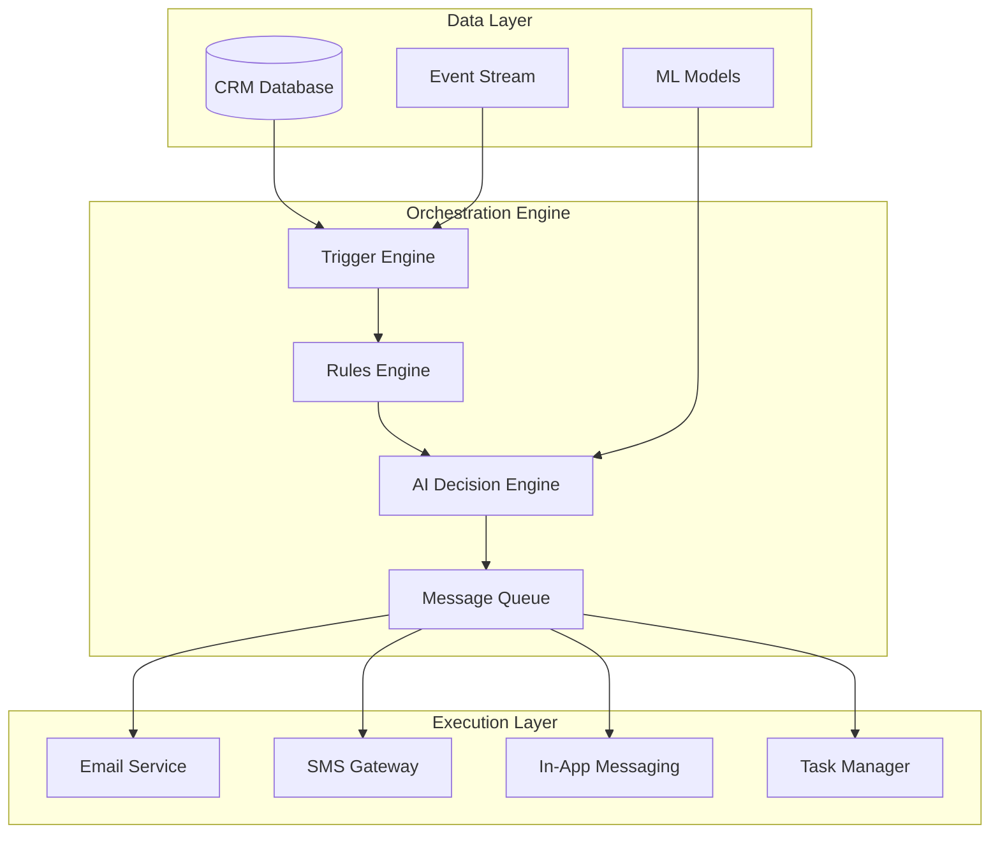
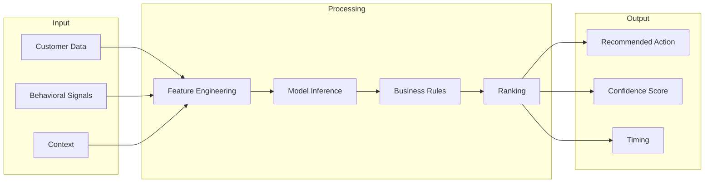
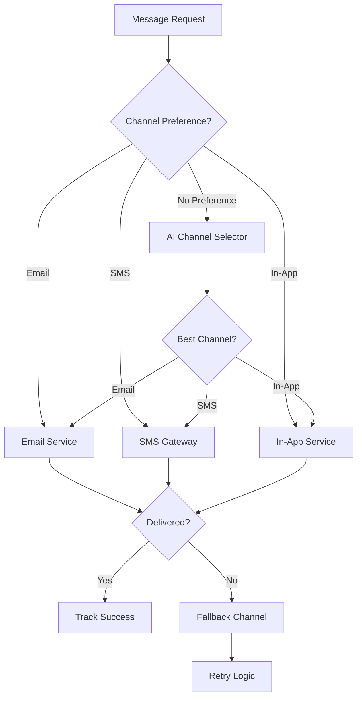

# Journey Orchestration Guide

> **Version:** 2.0 | **Updated:** January 2026
> **Framework:** AI-Powered Journey Orchestration

## Overview

This guide covers the technical implementation of customer journey orchestration, including triggers, automation rules, AI-powered decisioning, and integration patterns.

---

## Orchestration Architecture

### System Overview



### Core Components

| Component              | Purpose                               | Technology                      |
| ---------------------- | ------------------------------------- | ------------------------------- |
| **Trigger Engine**     | Detect events and conditions          | Event-driven architecture       |
| **Rules Engine**       | Evaluate conditions, route flows      | Decision trees, Boolean logic   |
| **AI Engine**          | Next-best-action, timing optimization | ML models, predictive analytics |
| **Message Queue**      | Reliable delivery, rate limiting      | Async processing                |
| **Execution Services** | Channel-specific delivery             | API integrations                |

---

## Triggers

### Trigger Types

#### 1. Event-Based Triggers

Fired when specific events occur in the system.

```typescript
// Customer lifecycle events
interface CustomerEvent {
  type: "customer.created" | "customer.updated" | "customer.deleted";
  customer_id: string;
  timestamp: Date;
  changes?: Record<string, any>;
}

// Behavioral events
interface BehaviorEvent {
  type: "page.viewed" | "feature.used" | "action.completed";
  customer_id: string;
  properties: Record<string, any>;
  timestamp: Date;
}

// Service events
interface ServiceEvent {
  type: "service.scheduled" | "service.completed" | "service.cancelled";
  customer_id: string;
  service_id: string;
  timestamp: Date;
}
```

**Common Event Triggers:**

| Event                           | Description             | Use Case                  |
| ------------------------------- | ----------------------- | ------------------------- |
| `customer.created`              | New customer added      | Start onboarding journey  |
| `customer.health_score_changed` | Health score updated    | Trigger risk intervention |
| `contract.expiring_soon`        | Contract within X days  | Start renewal journey     |
| `support.ticket_opened`         | Support case created    | Send acknowledgment       |
| `service.completed`             | Service delivered       | Request feedback          |
| `login.first`                   | First product login     | Begin adoption journey    |
| `feature.first_use`             | Feature used first time | Send tips/guidance        |

#### 2. Time-Based Triggers

Scheduled execution based on time conditions.

```yaml
# Schedule configurations
schedules:
  - name: "Morning Check-in"
    cron: "0 9 * * 1-5" # 9 AM weekdays
    timezone: "customer.timezone"

  - name: "Monthly Review"
    cron: "0 10 1 * *" # 10 AM, 1st of month

  - name: "Renewal Reminder"
    relative: "-30 days"
    anchor: "contract.end_date"
```

**Time Trigger Patterns:**

| Pattern           | Configuration         | Example                |
| ----------------- | --------------------- | ---------------------- |
| Fixed schedule    | Cron expression       | Daily at 9 AM          |
| Relative to event | Offset from timestamp | 7 days after signup    |
| Relative to date  | Offset from field     | 30 days before renewal |
| Business hours    | Constrained schedule  | Next business day 9-5  |

#### 3. Condition-Based Triggers

Evaluate when data conditions are met.

```typescript
interface ConditionTrigger {
  name: string;
  conditions: Condition[];
  logic: "AND" | "OR";
  evaluation: "real_time" | "batch";
  frequency?: string; // For batch evaluation
}

interface Condition {
  field: string;
  operator: "eq" | "ne" | "gt" | "gte" | "lt" | "lte" | "contains" | "in";
  value: any;
}
```

**Example Conditions:**

```yaml
triggers:
  - name: "At-Risk Detection"
    conditions:
      - field: "health_score"
        operator: "lt"
        value: 50
      - field: "days_since_login"
        operator: "gt"
        value: 14
    logic: "AND"
    action: "enroll_risk_mitigation_journey"

  - name: "Expansion Ready"
    conditions:
      - field: "usage_percentage"
        operator: "gte"
        value: 80
      - field: "health_score"
        operator: "gte"
        value: 70
      - field: "contract_months_remaining"
        operator: "lte"
        value: 6
    logic: "AND"
    action: "enroll_expansion_journey"
```

#### 4. AI-Powered Triggers

Machine learning models predicting optimal moments.

```typescript
interface AIPrediction {
  model: string;
  customer_id: string;
  prediction: {
    action: string;
    confidence: number;
    timing: Date;
    reasoning: string[];
  };
}

// Example predictions
const predictions = {
  churn_risk: {
    model: "churn_predictor_v2",
    threshold: 0.7,
    action: "escalate_to_csm",
  },
  upsell_propensity: {
    model: "expansion_scorer",
    threshold: 0.6,
    action: "trigger_expansion_journey",
  },
  optimal_send_time: {
    model: "engagement_optimizer",
    output: "timestamp",
    use: "schedule_message",
  },
};
```

---

## Rules Engine

### Rule Structure

```typescript
interface Rule {
  id: string;
  name: string;
  priority: number; // Lower = higher priority
  conditions: ConditionGroup;
  actions: Action[];
  exceptions?: ConditionGroup;
  schedule?: Schedule;
  limits?: RateLimits;
}

interface ConditionGroup {
  logic: "AND" | "OR";
  conditions: (Condition | ConditionGroup)[];
}

interface Action {
  type: string;
  params: Record<string, any>;
  delay?: Duration;
  retry?: RetryConfig;
}
```

### Rule Examples

#### Journey Enrollment Rules

```yaml
rules:
  - id: "onboarding_enrollment"
    name: "Auto-enroll new customers in onboarding"
    priority: 1
    conditions:
      logic: AND
      conditions:
        - field: "event.type"
          operator: "eq"
          value: "customer.created"
        - field: "customer.type"
          operator: "ne"
          value: "trial"
    actions:
      - type: "enroll_journey"
        params:
          journey_id: "onboarding_v2"

  - id: "risk_intervention"
    name: "Escalate at-risk customers"
    priority: 2
    conditions:
      logic: AND
      conditions:
        - field: "customer.health_score"
          operator: "lt"
          value: 40
        - field: "customer.arr"
          operator: "gt"
          value: 10000
    exceptions:
      logic: OR
      conditions:
        - field: "customer.journey_active"
          operator: "eq"
          value: "risk_mitigation"
        - field: "customer.csm_engaged"
          operator: "eq"
          value: true
    actions:
      - type: "create_alert"
        params:
          severity: "high"
          assignee: "{{customer.csm_id}}"
      - type: "enroll_journey"
        params:
          journey_id: "risk_mitigation"
```

#### Progression Rules

```yaml
rules:
  - id: "stage_1_complete"
    name: "Progress from Welcome to Activation"
    conditions:
      logic: AND
      conditions:
        - field: "journey.current_stage"
          operator: "eq"
          value: "welcome"
        - field: "customer.first_login"
          operator: "exists"
        - field: "customer.profile_complete"
          operator: "eq"
          value: true
    actions:
      - type: "advance_stage"
        params:
          stage: "activation"
```

### Rule Prioritization

| Priority | Category | Example                     |
| -------- | -------- | --------------------------- |
| 1-10     | Critical | Security, compliance        |
| 11-50    | High     | Revenue, churn prevention   |
| 51-100   | Medium   | Engagement, adoption        |
| 101-500  | Low      | Informational, nice-to-have |

---

## AI Decision Engine

### Next-Best-Action Framework



### Model Types

| Model                    | Purpose                         | Output                 |
| ------------------------ | ------------------------------- | ---------------------- |
| **Churn Predictor**      | Identify at-risk customers      | Risk score 0-100       |
| **Engagement Scorer**    | Predict response likelihood     | Engagement probability |
| **Send Time Optimizer**  | Best time to reach customer     | Optimal timestamp      |
| **Channel Selector**     | Preferred communication channel | Channel ranking        |
| **Content Personalizer** | Most relevant content           | Content ID + score     |

### Implementation Example

```typescript
interface NBActionRequest {
  customer_id: string;
  context: {
    current_journey?: string;
    recent_interactions: Interaction[];
    available_actions: string[];
  };
}

interface NBActionResponse {
  recommended_action: {
    action_type: string;
    action_params: Record<string, any>;
    confidence: number;
    reasoning: string;
  };
  alternatives: Array<{
    action_type: string;
    confidence: number;
  }>;
  timing: {
    optimal_time: Date;
    time_window: { start: Date; end: Date };
  };
}

// API Call
async function getNextBestAction(
  request: NBActionRequest,
): Promise<NBActionResponse> {
  const response = await aiEngine.predict({
    model: "next_best_action_v3",
    input: request,
    constraints: {
      max_daily_touches: 2,
      channel_preferences: true,
      business_hours_only: true,
    },
  });
  return response;
}
```

---

## Channel Orchestration

### Multi-Channel Strategy



### Channel Configuration

```yaml
channels:
  email:
    provider: "sendgrid"
    rate_limit: 100/minute
    retry_policy:
      max_attempts: 3
      backoff: exponential
    fallback: "sms"

  sms:
    provider: "twilio"
    rate_limit: 50/minute
    character_limit: 160
    opt_out_check: true
    fallback: "in_app"

  in_app:
    provider: "internal"
    persistence: 7_days
    priority_levels: [urgent, normal, low]

  push:
    provider: "firebase"
    platforms: [ios, android, web]
    silent_hours: "22:00-08:00"
```

### Channel Selection Logic

```typescript
interface ChannelDecision {
  primary: Channel;
  fallback: Channel[];
  reasoning: string;
}

function selectChannel(
  customer: Customer,
  message: Message,
  context: Context,
): ChannelDecision {
  // 1. Check explicit preference
  if (customer.channel_preference) {
    return {
      primary: customer.channel_preference,
      fallback: getDefaultFallbacks(customer.channel_preference),
      reasoning: "Customer preference",
    };
  }

  // 2. Check message urgency
  if (message.urgency === "high") {
    return {
      primary: "sms",
      fallback: ["email", "in_app"],
      reasoning: "High urgency message",
    };
  }

  // 3. Use AI prediction
  const prediction = aiChannelSelector.predict(customer, message);
  return {
    primary: prediction.channel,
    fallback: prediction.alternatives,
    reasoning: `AI confidence: ${prediction.confidence}`,
  };
}
```

---

## Rate Limiting & Throttling

### Customer-Level Limits

```yaml
rate_limits:
  customer:
    email:
      daily: 3
      weekly: 10
      monthly: 30
    sms:
      daily: 1
      weekly: 3
      monthly: 10
    in_app:
      daily: 5
      weekly: 20
    total:
      daily: 5
      weekly: 15

  global:
    email:
      per_minute: 1000
      per_hour: 50000
    sms:
      per_minute: 100
      per_hour: 5000
```

### Fatigue Management

```typescript
interface FatigueConfig {
  cooldown_periods: {
    after_unsubscribe: Duration;
    after_complaint: Duration;
    after_bounce: Duration;
  };
  engagement_based: {
    highly_engaged: { multiplier: 1.5 };
    moderately_engaged: { multiplier: 1.0 };
    low_engagement: { multiplier: 0.5 };
    disengaged: { suppress: true };
  };
}

function checkFatigue(customer: Customer, message: Message): FatigueResult {
  // Count recent touches
  const recentTouches = getRecentTouches(customer.id, "7d");
  const limit = getRateLimit(customer, message.channel);

  if (recentTouches >= limit) {
    return {
      allow: false,
      reason: "Rate limit exceeded",
      next_available: calculateNextWindow(customer),
    };
  }

  // Check engagement-based suppression
  const engagement = customer.engagement_level;
  if (engagement === "disengaged" && message.priority !== "critical") {
    return {
      allow: false,
      reason: "Customer disengaged - suppressed",
      recommendation: "Consider re-engagement campaign",
    };
  }

  return { allow: true };
}
```

---

## Error Handling & Recovery

### Error Categories

| Category      | Examples                    | Recovery Strategy                 |
| ------------- | --------------------------- | --------------------------------- |
| **Transient** | Network timeout, rate limit | Retry with backoff                |
| **Permanent** | Invalid email, unsubscribed | Skip, log, alert                  |
| **Partial**   | Some recipients failed      | Retry failed only                 |
| **System**    | Service down                | Queue, alert, manual intervention |

### Retry Configuration

```yaml
retry_policies:
  default:
    max_attempts: 3
    backoff:
      type: exponential
      initial_delay: 1m
      max_delay: 1h
      multiplier: 2

  critical:
    max_attempts: 5
    backoff:
      type: linear
      initial_delay: 30s
      increment: 1m
    alert_on_failure: true

  low_priority:
    max_attempts: 2
    backoff:
      type: fixed
      delay: 5m
    drop_after_failure: true
```

### Dead Letter Handling

```typescript
interface DeadLetterItem {
  id: string;
  original_message: Message;
  failure_reason: string;
  attempt_count: number;
  timestamps: {
    first_attempt: Date;
    last_attempt: Date;
  };
  status: "pending_review" | "retrying" | "abandoned";
}

// Dead letter processing
async function processDeadLetter(item: DeadLetterItem): Promise<void> {
  // Analyze failure
  const analysis = analyzeFailure(item);

  if (analysis.recoverable) {
    // Fix and retry
    const fixed = await applyFix(item, analysis.fix);
    await retryMessage(fixed);
  } else {
    // Log and alert
    await logPermanentFailure(item, analysis);
    if (analysis.requires_attention) {
      await createAlert({
        type: "dead_letter",
        severity: "medium",
        item: item,
      });
    }
  }
}
```

---

## Monitoring & Observability

### Key Metrics

| Metric                      | Description               | Alert Threshold |
| --------------------------- | ------------------------- | --------------- |
| **Journey Enrollment Rate** | New enrollments/hour      | < 80% expected  |
| **Step Completion Rate**    | Steps completed/attempted | < 95%           |
| **Message Delivery Rate**   | Delivered/sent            | < 98%           |
| **Error Rate**              | Errors/total operations   | > 1%            |
| **Queue Depth**             | Pending messages          | > 10,000        |
| **Processing Latency**      | Time to process trigger   | > 5s            |

### Dashboard Components

```yaml
dashboards:
  - name: "Journey Health"
    panels:
      - title: "Active Journeys"
        type: gauge
        query: "count(journey.status = 'active')"

      - title: "Enrollment Rate"
        type: timeseries
        query: "rate(journey.enrollments[5m])"

      - title: "Completion Funnel"
        type: funnel
        stages: ["enrolled", "stage_1", "stage_2", "completed"]

      - title: "Error Rate"
        type: timeseries
        query: "rate(orchestration.errors[5m])"
        alert: "> 0.01"

  - name: "Channel Performance"
    panels:
      - title: "Delivery by Channel"
        type: bar
        breakdown: channel

      - title: "Response Rates"
        type: heatmap
        dimensions: [channel, hour_of_day]
```

### Alerting Rules

```yaml
alerts:
  - name: "High Error Rate"
    condition: "error_rate > 0.01 for 5m"
    severity: critical
    notify: [oncall, slack_channel]

  - name: "Queue Backup"
    condition: "queue_depth > 10000"
    severity: warning
    notify: [slack_channel]

  - name: "Journey Stalled"
    condition: "journey.progression_rate < 0.5 for 24h"
    severity: info
    notify: [journey_owner]
```

---

## Integration Patterns

### Event Publishing

```typescript
// Publish events for external systems
interface EventPublisher {
  publish(event: JourneyEvent): Promise<void>;
}

interface JourneyEvent {
  type: string;
  journey_id: string;
  customer_id: string;
  timestamp: Date;
  data: Record<string, any>;
}

// Example events
const events = [
  { type: 'journey.enrolled', ... },
  { type: 'journey.stage_changed', ... },
  { type: 'journey.completed', ... },
  { type: 'journey.exited', ... },
  { type: 'message.sent', ... },
  { type: 'message.engaged', ... }
];
```

### Webhook Configuration

```yaml
webhooks:
  - name: "CRM Sync"
    url: "https://crm.example.com/webhooks/journey"
    events: ["journey.completed", "journey.exited"]
    auth:
      type: "bearer"
      token_env: "CRM_WEBHOOK_TOKEN"
    retry: true

  - name: "Analytics"
    url: "https://analytics.example.com/ingest"
    events: ["*"] # All events
    batch:
      enabled: true
      size: 100
      window: 60s
```

### API Endpoints

```typescript
// Journey Management API
interface JourneyAPI {
  // Enrollment
  POST   /journeys/{id}/enroll
  DELETE /journeys/{id}/customers/{customer_id}

  // Status
  GET    /journeys/{id}/customers/{customer_id}/status
  GET    /journeys/{id}/metrics

  // Control
  POST   /journeys/{id}/pause
  POST   /journeys/{id}/resume
  POST   /journeys/{id}/customers/{customer_id}/advance

  // Configuration
  GET    /journeys/{id}
  PUT    /journeys/{id}
  POST   /journeys/{id}/test
}
```

---

## Best Practices

### Performance Optimization

1. **Batch Processing**: Group similar operations
2. **Caching**: Cache customer data, templates, rules
3. **Async Execution**: Non-blocking message delivery
4. **Connection Pooling**: Reuse database/API connections
5. **Indexing**: Optimize queries on trigger conditions

### Reliability Patterns

1. **Idempotency**: Safe to retry any operation
2. **Circuit Breakers**: Fail fast on service issues
3. **Graceful Degradation**: Continue with reduced functionality
4. **Bulkheads**: Isolate failures to prevent cascade
5. **Health Checks**: Continuous system monitoring

### Security Considerations

1. **Data Encryption**: At rest and in transit
2. **Access Control**: Role-based permissions
3. **Audit Logging**: Track all changes and access
4. **PII Handling**: Mask sensitive data in logs
5. **Rate Limiting**: Prevent abuse

---

## Troubleshooting Guide

### Common Issues

| Issue                   | Symptoms                     | Resolution                      |
| ----------------------- | ---------------------------- | ------------------------------- |
| Messages not sending    | Queue growing, no deliveries | Check channel provider status   |
| Triggers not firing     | No new enrollments           | Verify event publishing         |
| Wrong stage progression | Customers stuck or skipping  | Review rule conditions          |
| Duplicate messages      | Same message multiple times  | Check idempotency keys          |
| High latency            | Slow processing              | Scale workers, optimize queries |

### Diagnostic Queries

```sql
-- Check stuck journeys
SELECT journey_id, stage, COUNT(*)
FROM journey_enrollments
WHERE updated_at < NOW() - INTERVAL '7 days'
  AND status = 'active'
GROUP BY journey_id, stage;

-- Message delivery issues
SELECT channel, status, COUNT(*)
FROM messages
WHERE sent_at > NOW() - INTERVAL '24 hours'
GROUP BY channel, status;

-- Trigger performance
SELECT trigger_name, AVG(processing_time_ms), COUNT(*)
FROM trigger_executions
WHERE executed_at > NOW() - INTERVAL '1 hour'
GROUP BY trigger_name
ORDER BY AVG(processing_time_ms) DESC;
```

---

**Next:** See [Journey Examples](./examples/) for real-world implementations.
