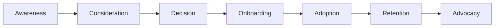

# Customer Journey Documentation Framework

> **Version:** 2.0 | **Updated:** January 2026
> **Framework:** World-Class Customer Journey Orchestration

## Overview

This framework provides a comprehensive system for designing, documenting, and orchestrating customer journeys that drive exceptional outcomes. Built on 2025-2026 best practices from industry leaders including Gartner, Forrester, and NNGroup.

## Quick Start

### 1. Choose Your Journey Type

| Journey Type        | Use Case                        | Complexity |
| ------------------- | ------------------------------- | ---------- |
| **Onboarding**      | New customer activation         | Medium     |
| **Retention**       | Reduce churn, increase loyalty  | High       |
| **Expansion**       | Upsell/cross-sell opportunities | Medium     |
| **Advocacy**        | Turn customers into promoters   | Low        |
| **Risk Mitigation** | Proactive churn prevention      | High       |
| **Win-Back**        | Re-engage churned customers     | Medium     |

### 2. Define Your Personas

Every journey should target specific customer personas:

```markdown
**Persona:** [Name]

- **Role:** Decision maker / User / Influencer
- **Goals:** What they want to achieve
- **Pain Points:** Challenges they face
- **Preferred Channels:** Email, SMS, In-app, Phone
- **Success Metrics:** How they measure value
```

### 3. Map the Journey Stages



## Framework Components

### Core Documents

| Document                                           | Purpose                   |
| -------------------------------------------------- | ------------------------- |
| [TEMPLATE.md](./TEMPLATE.md)                       | Complete journey template |
| [ORCHESTRATION_GUIDE.md](./ORCHESTRATION_GUIDE.md) | Automation & triggers     |
| [BEST_PRACTICES_2026.md](./BEST_PRACTICES_2026.md) | Research & insights       |

### Journey Examples

| Example                                                    | Industry | Focus      |
| ---------------------------------------------------------- | -------- | ---------- |
| [Customer Onboarding](./examples/ONBOARDING_JOURNEY.md)    | Service  | Activation |
| [Churn Prevention](./examples/CHURN_PREVENTION_JOURNEY.md) | Service  | Retention  |
| [Service Upgrade](./examples/SERVICE_UPGRADE_JOURNEY.md)   | Service  | Expansion  |

## Key Principles

### 1. Customer-Centric Design

- Start with customer goals, not business goals
- Map emotional states at each touchpoint
- Identify friction points and eliminate them
- Measure success from the customer's perspective

### 2. Data-Driven Orchestration

- Use behavioral triggers, not just time-based
- Leverage AI for next-best-action decisions
- Personalize at scale with segmentation
- Continuously optimize based on metrics

### 3. Omnichannel Continuity

- Maintain context across all channels
- Hand off seamlessly between touchpoints
- Respect channel preferences
- Ensure consistent messaging

### 4. Proactive Engagement

- Anticipate needs before they arise
- Use predictive analytics for timing
- Intervene at moments of risk
- Celebrate moments of success

## Metrics Framework

### Primary KPIs

| Metric                          | Description                     | Target   |
| ------------------------------- | ------------------------------- | -------- |
| **Time-to-Value (TTV)**         | Time from signup to first value | < 7 days |
| **Activation Rate**             | % completing key milestone      | > 80%    |
| **Health Score**                | Composite engagement score      | > 70     |
| **Net Promoter Score (NPS)**    | Likelihood to recommend         | > 50     |
| **Customer Effort Score (CES)** | Ease of interaction             | > 4.0    |

### Stage-Specific Metrics

| Stage      | Key Metric        | Secondary Metrics             |
| ---------- | ----------------- | ----------------------------- |
| Onboarding | Activation Rate   | TTV, First-session completion |
| Adoption   | Feature Usage     | DAU/MAU, Session depth        |
| Retention  | Renewal Rate      | Churn rate, NPS trend         |
| Expansion  | Expansion Revenue | Upsell conversion, ARPU       |
| Advocacy   | Referral Rate     | Reviews, Case studies         |

## Implementation Checklist

### Planning Phase

- [ ] Define journey objectives and success criteria
- [ ] Identify target personas
- [ ] Map current state (as-is journey)
- [ ] Design future state (to-be journey)
- [ ] Identify required data and integrations

### Build Phase

- [ ] Create journey stages and steps
- [ ] Define triggers and conditions
- [ ] Configure automation rules
- [ ] Set up personalization logic
- [ ] Create content for each touchpoint

### Launch Phase

- [ ] Test all automation flows
- [ ] Validate trigger conditions
- [ ] Review content for accuracy
- [ ] Set up monitoring dashboards
- [ ] Document rollback procedures

### Optimize Phase

- [ ] Monitor key metrics daily
- [ ] Analyze drop-off points
- [ ] A/B test messaging and timing
- [ ] Gather customer feedback
- [ ] Iterate based on learnings

## Integration with Mac-Septic-CRM

### Available Triggers

```typescript
// Customer Events
customer.created;
customer.health_score_changed;
customer.risk_level_changed;
customer.contract_expiring;

// Interaction Events
interaction.completed;
interaction.missed;
interaction.sentiment_detected;

// Service Events
service.scheduled;
service.completed;
service.issue_reported;
```

### Automation Actions

```typescript
// Communication
send_email(template_id, personalization);
send_sms(message, scheduling);
create_task(assignee, due_date, priority);

// Journey Management
enroll_in_journey(journey_id);
advance_stage(stage_id);
pause_journey(reason);
exit_journey(outcome);

// Data Updates
update_health_score(factors);
add_tag(tag_name);
update_segment(segment_id);
```

## Best Practices Summary

### Do's

- **Do** start small and iterate
- **Do** involve CSMs in journey design
- **Do** test before launching
- **Do** measure everything
- **Do** listen to customer feedback
- **Do** document all changes

### Don'ts

- **Don't** over-automate human moments
- **Don't** ignore channel preferences
- **Don't** set and forget
- **Don't** overwhelm with touchpoints
- **Don't** forget mobile experience
- **Don't** skip the planning phase

## Resources

- [Journey Template](./TEMPLATE.md) - Start here
- [Orchestration Guide](./ORCHESTRATION_GUIDE.md) - Automation details
- [Best Practices 2026](./BEST_PRACTICES_2026.md) - Research insights
- [Examples](./examples/) - Real-world implementations

---

**Next Steps:** Start with the [Journey Template](./TEMPLATE.md) to create your first journey.
