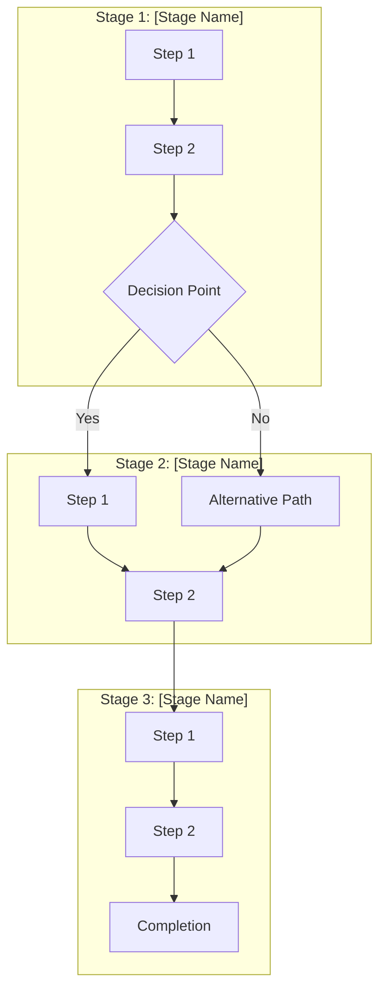

# Customer Journey Template

> **Version:** 2.0 | **Last Updated:** January 2026
> **Status:** Template

---

## Journey Overview

### Basic Information

| Field             | Value                                                           |
| ----------------- | --------------------------------------------------------------- |
| **Journey Name**  | [Enter journey name]                                            |
| **Journey ID**    | `journey_[type]_[version]`                                      |
| **Type**          | Onboarding / Retention / Expansion / Advocacy / Risk Mitigation |
| **Status**        | Draft / Active / Paused / Archived                              |
| **Owner**         | [CSM or Team Name]                                              |
| **Created**       | [Date]                                                          |
| **Last Modified** | [Date]                                                          |

### Objective Statement

> **Goal:** [One sentence describing what this journey achieves]
>
> **Success Criteria:** [Measurable outcome that indicates success]

### Target Audience

| Attribute           | Criteria                                     |
| ------------------- | -------------------------------------------- |
| **Segment**         | [Customer segment name]                      |
| **Persona**         | [Primary persona]                            |
| **Lifecycle Stage** | [New / Growing / Mature / At-Risk]           |
| **Conditions**      | [Entry criteria - e.g., "Health score < 60"] |

---

## Journey Map

### Visual Flow



### Stage Details

---

## Stage 1: [Stage Name]

### Overview

| Attribute         | Value                       |
| ----------------- | --------------------------- |
| **Duration**      | [X days/weeks]              |
| **Goal**          | [What this stage achieves]  |
| **Entry Trigger** | [What starts this stage]    |
| **Exit Criteria** | [What completes this stage] |

### Emotional State

| Aspect               | Description                        |
| -------------------- | ---------------------------------- |
| **Starting Emotion** | [How customer feels entering]      |
| **Target Emotion**   | [How customer should feel exiting] |
| **Pain Points**      | [Frustrations to address]          |
| **Gains**            | [Value delivered]                  |

### Steps

#### Step 1.1: [Step Name]

| Field       | Value                                                 |
| ----------- | ----------------------------------------------------- |
| **Type**    | Email / SMS / In-App / Task / Wait / Condition        |
| **Channel** | [Primary channel]                                     |
| **Timing**  | [When this executes - e.g., "Immediately" or "Day 1"] |
| **Owner**   | Automated / CSM / Support                             |

**Content/Action:**

```
[Describe the content, message, or action to take]
```

**Personalization Variables:**

- `{{customer.name}}` - Customer name
- `{{customer.company}}` - Company name
- `{{csm.name}}` - Assigned CSM name
- `{{custom.variable}}` - Custom data point

**Success Criteria:**

- [ ] [Measurable outcome for this step]

---

#### Step 1.2: [Step Name]

| Field       | Value                                          |
| ----------- | ---------------------------------------------- |
| **Type**    | Email / SMS / In-App / Task / Wait / Condition |
| **Channel** | [Primary channel]                              |
| **Timing**  | [When this executes]                           |
| **Owner**   | Automated / CSM / Support                      |

**Content/Action:**

```
[Describe the content, message, or action to take]
```

**Conditions:**

```
IF [condition] THEN [action]
ELSE [alternative action]
```

---

#### Step 1.3: Decision Point - [Name]

| Condition           | Path                       |
| ------------------- | -------------------------- |
| `[condition A]`     | Proceed to Stage 2, Path A |
| `[condition B]`     | Proceed to Stage 2, Path B |
| `[timeout/default]` | [Default action]           |

---

## Stage 2: [Stage Name]

### Overview

| Attribute         | Value                       |
| ----------------- | --------------------------- |
| **Duration**      | [X days/weeks]              |
| **Goal**          | [What this stage achieves]  |
| **Entry Trigger** | [What starts this stage]    |
| **Exit Criteria** | [What completes this stage] |

### Emotional State

| Aspect               | Description                        |
| -------------------- | ---------------------------------- |
| **Starting Emotion** | [How customer feels entering]      |
| **Target Emotion**   | [How customer should feel exiting] |
| **Pain Points**      | [Frustrations to address]          |
| **Gains**            | [Value delivered]                  |

### Steps

#### Step 2.1: [Step Name]

| Field       | Value     |
| ----------- | --------- |
| **Type**    | [Type]    |
| **Channel** | [Channel] |
| **Timing**  | [Timing]  |
| **Owner**   | [Owner]   |

**Content/Action:**

```
[Content details]
```

---

## Stage 3: [Stage Name]

### Overview

| Attribute         | Value                       |
| ----------------- | --------------------------- |
| **Duration**      | [X days/weeks]              |
| **Goal**          | [What this stage achieves]  |
| **Entry Trigger** | [What starts this stage]    |
| **Exit Criteria** | [What completes this stage] |

### Steps

#### Step 3.1: [Step Name]

[Details...]

---

## Automation Rules

### Triggers

| Trigger            | Condition                       | Action                        |
| ------------------ | ------------------------------- | ----------------------------- |
| **Entry**          | [Condition that starts journey] | Enroll in journey             |
| **Progression**    | [Condition to advance]          | Move to next stage            |
| **Exit - Success** | [Success criteria met]          | Mark complete, update metrics |
| **Exit - Failure** | [Failure criteria]              | Exit, trigger follow-up       |
| **Exit - Manual**  | CSM intervention                | Log reason, pause automation  |

### Conditional Logic

```yaml
rules:
  - name: "High-Value Fast Track"
    condition: "customer.arr > 100000"
    action: "skip_to_stage_2"

  - name: "At-Risk Intervention"
    condition: "customer.health_score < 40"
    action: "escalate_to_csm"

  - name: "Engagement Check"
    condition: "days_since_login > 14"
    action: "send_reengagement_email"
```

### Wait Conditions

| Wait Type          | Configuration                  |
| ------------------ | ------------------------------ |
| **Time-based**     | Wait X days/hours              |
| **Event-based**    | Wait until [event] occurs      |
| **Conditional**    | Wait until [condition] is true |
| **Business Hours** | Execute only during [hours]    |

---

## Content Library

### Email Templates

#### Template 1: [Template Name]

| Field            | Value            |
| ---------------- | ---------------- |
| **Subject Line** | [Subject]        |
| **Preview Text** | [Preview]        |
| **CTA**          | [Call to action] |

**Body:**

```
Hi {{customer.name}},

[Email body content with personalization]

Best regards,
{{csm.name}}
```

---

#### Template 2: [Template Name]

[Template details...]

---

### SMS Templates

#### SMS 1: [Template Name]

```
[SMS content - max 160 characters]
{{short_link}}
```

---

### In-App Messages

#### In-App 1: [Message Name]

| Field           | Value                               |
| --------------- | ----------------------------------- |
| **Type**        | Modal / Banner / Tooltip / Slideout |
| **Trigger**     | [Page/action that triggers]         |
| **Dismissible** | Yes / No                            |

**Content:**

```
[In-app message content]
```

---

## Metrics & Measurement

### Journey KPIs

| Metric               | Target   | Current  | Status                      |
| -------------------- | -------- | -------- | --------------------------- |
| **Completion Rate**  | [X%]     | [Y%]     | On Track / At Risk / Behind |
| **Time to Complete** | [X days] | [Y days] | On Track / At Risk / Behind |
| **Drop-off Rate**    | [<X%]    | [Y%]     | On Track / At Risk / Behind |
| **Conversion Rate**  | [X%]     | [Y%]     | On Track / At Risk / Behind |

### Stage Metrics

| Stage   | Entry Rate | Completion Rate | Avg Duration | Drop-off Point |
| ------- | ---------- | --------------- | ------------ | -------------- |
| Stage 1 | 100%       | [X%]            | [X days]     | [Step name]    |
| Stage 2 | [X%]       | [X%]            | [X days]     | [Step name]    |
| Stage 3 | [X%]       | [X%]            | [X days]     | [Step name]    |

### Step Performance

| Step     | Sent | Opened | Clicked | Converted |
| -------- | ---- | ------ | ------- | --------- |
| Step 1.1 | [N]  | [X%]   | [X%]    | [X%]      |
| Step 1.2 | [N]  | [X%]   | [X%]    | [X%]      |
| Step 2.1 | [N]  | [X%]   | [X%]    | [X%]      |

---

## Testing Checklist

### Pre-Launch

- [ ] All triggers tested and firing correctly
- [ ] Conditional logic validated
- [ ] Email templates reviewed and approved
- [ ] Personalization variables rendering correctly
- [ ] Links tested and tracking properly
- [ ] Mobile rendering verified
- [ ] Unsubscribe/opt-out working
- [ ] Exit conditions functioning

### Post-Launch (Week 1)

- [ ] Entry rates matching expectations
- [ ] No error reports
- [ ] Step completion tracking accurately
- [ ] CSM feedback collected
- [ ] Initial metrics reviewed

### Ongoing (Monthly)

- [ ] Performance vs. targets reviewed
- [ ] Drop-off points analyzed
- [ ] A/B test results evaluated
- [ ] Content refreshed if needed
- [ ] Automation rules optimized

---

## Change Log

| Date   | Version | Author | Changes                  |
| ------ | ------- | ------ | ------------------------ |
| [Date] | 1.0     | [Name] | Initial creation         |
| [Date] | 1.1     | [Name] | [Description of changes] |

---

## Appendix

### Related Journeys

- [Link to related journey 1]
- [Link to related journey 2]

### Dependencies

- [System or integration dependency 1]
- [System or integration dependency 2]

### Stakeholders

| Role      | Name   | Responsibility            |
| --------- | ------ | ------------------------- |
| Owner     | [Name] | Overall accountability    |
| Content   | [Name] | Messaging and copy        |
| Technical | [Name] | Automation setup          |
| Analytics | [Name] | Measurement and reporting |

---

**Template Version:** 2.0
**Framework:** Customer Journey Documentation Framework 2026
