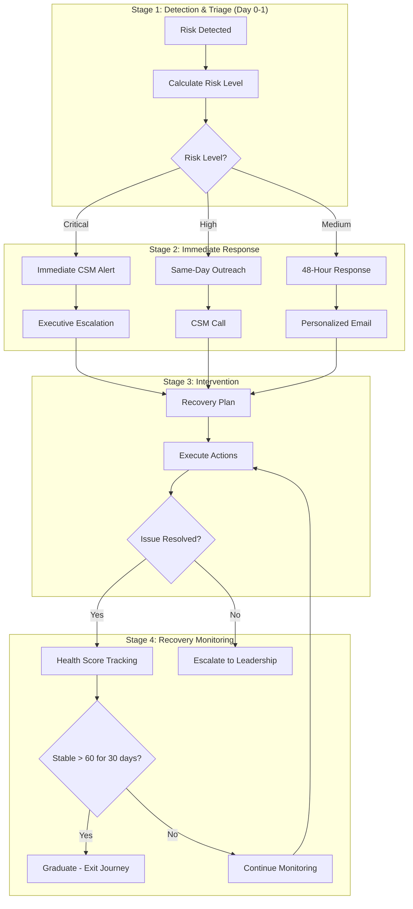

# Churn Prevention Journey

> **Journey ID:** `journey_churn_prevention_v2`
> **Type:** Risk Mitigation
> **Status:** Active
> **Owner:** Customer Success Team

---

## Journey Overview

### Objective Statement

> **Goal:** Identify at-risk customers early and intervene to prevent churn through proactive engagement
>
> **Success Criteria:** Reduce churn rate by 30% among enrolled customers; recover 60% of at-risk accounts to health score > 60

### Target Audience

| Attribute            | Criteria                                      |
| -------------------- | --------------------------------------------- |
| **Segment**          | At-Risk Customers                             |
| **Persona**          | All customer types                            |
| **Lifecycle Stage**  | Active, showing risk signals                  |
| **Entry Conditions** | Health score < 50 OR 2+ risk factors detected |

### Risk Signals Monitored

| Signal                 | Weight   | Description                            |
| ---------------------- | -------- | -------------------------------------- |
| **Health Score Drop**  | High     | Score decreased > 20 points in 30 days |
| **Login Decline**      | Medium   | No login in 30+ days                   |
| **Service Decline**    | High     | Cancelled or postponed services        |
| **Support Escalation** | High     | Unresolved support ticket > 7 days     |
| **Payment Issues**     | Critical | Failed payment or past due             |
| **NPS Detractor**      | High     | NPS score 0-6                          |
| **Usage Decline**      | Medium   | Feature usage dropped > 50%            |

---

## Journey Map

### Visual Flow



---

## Stage 1: Detection & Triage

### Overview

| Attribute         | Value                                                |
| ----------------- | ---------------------------------------------------- |
| **Duration**      | Days 0-1                                             |
| **Goal**          | Quickly assess risk severity and route appropriately |
| **Entry Trigger** | Risk signal detected (see criteria above)            |
| **Exit Criteria** | Risk level assigned and routed                       |

### Risk Level Calculation

```yaml
risk_levels:
  critical:
    criteria:
      - health_score < 30
      - OR: payment_past_due > 30_days
      - OR: explicit_churn_intent
    response_time: immediate
    owner: leadership + csm

  high:
    criteria:
      - health_score < 50
      - AND: (risk_factors >= 2 OR arr > 50000)
    response_time: same_day
    owner: csm

  medium:
    criteria:
      - health_score < 60
      - OR: risk_factors == 1
    response_time: 48_hours
    owner: csm
```

### Steps

#### Step 1.1: Risk Detection Alert

| Field       | Value                    |
| ----------- | ------------------------ |
| **Type**    | System Alert             |
| **Channel** | Internal                 |
| **Timing**  | Immediately on detection |
| **Owner**   | Automated                |

**Alert Content:**

```
🚨 CHURN RISK DETECTED

Customer: {{customer.name}}
Account ID: {{customer.id}}
ARR: {{customer.arr}}
CSM: {{customer.csm_name}}

Risk Signals:
{{#each risk_factors}}
  - {{this.name}}: {{this.value}} ({{this.severity}})
{{/each}}

Health Score: {{customer.health_score}} (was {{customer.previous_health_score}})
Trend: {{health_trend}}

Action Required: Triage and respond per risk level protocol
```

---

#### Step 1.2: Risk Level Assignment

| Field       | Value                       |
| ----------- | --------------------------- |
| **Type**    | Automated Calculation       |
| **Channel** | System                      |
| **Timing**  | Immediately after detection |
| **Owner**   | Automated                   |

**Logic:**

```typescript
function calculateRiskLevel(customer: Customer): RiskLevel {
  // Critical conditions
  if (customer.health_score < 30) return "critical";
  if (customer.payment_past_due_days > 30) return "critical";
  if (customer.churn_intent_expressed) return "critical";

  // High conditions
  if (
    customer.health_score < 50 &&
    (customer.risk_factors.length >= 2 || customer.arr > 50000)
  ) {
    return "high";
  }

  // Medium conditions
  if (customer.health_score < 60 || customer.risk_factors.length >= 1) {
    return "medium";
  }

  return "low";
}
```

---

## Stage 2: Immediate Response

### Critical Risk Path

#### Step 2.1C: Immediate CSM Alert

| Field       | Value               |
| ----------- | ------------------- |
| **Type**    | Multi-channel Alert |
| **Channel** | SMS + Slack + Email |
| **Timing**  | Immediate           |
| **Owner**   | CSM + Manager       |

**SMS to CSM:**

```
🚨 CRITICAL: {{customer.name}} ({{customer.arr}} ARR) at severe churn risk. Health: {{health_score}}. Immediate action required. Check Slack for details.
```

**Slack Message:**

```
@{{csm.slack_handle}} @{{manager.slack_handle}}

🚨 **CRITICAL CHURN RISK**

**Customer:** {{customer.name}}
**ARR:** {{customer.arr}}
**Health Score:** {{customer.health_score}}

**Risk Factors:**
{{risk_factors_list}}

**Recent Activity:**
{{recent_activity_summary}}

**Recommended Actions:**
1. Call customer within 1 hour
2. Loop in leadership if needed
3. Prepare retention offer if appropriate

**Customer Contact:** {{customer.phone}} | {{customer.email}}

React with ✅ when you've taken action.
```

---

#### Step 2.2C: Executive Escalation

| Field       | Value                              |
| ----------- | ---------------------------------- |
| **Type**    | Task + Meeting                     |
| **Channel** | Calendar + Email                   |
| **Timing**  | Within 2 hours if CSM hasn't acted |
| **Owner**   | CS Leadership                      |

**Escalation Condition:**

```yaml
if:
  - risk_level == 'critical'
  - time_since_detection > 2_hours
  - csm_action_taken == false
then:
  - notify_cs_leadership
  - schedule_emergency_meeting
```

---

### High Risk Path

#### Step 2.1H: Same-Day Outreach Task

| Field       | Value          |
| ----------- | -------------- |
| **Type**    | Task           |
| **Channel** | Phone          |
| **Timing**  | Within 4 hours |
| **Owner**   | CSM            |

**Task:**

```
HIGH PRIORITY: At-Risk Customer Outreach

Customer: {{customer.name}}
ARR: {{customer.arr}}
Health Score: {{customer.health_score}}
Risk Level: HIGH

Risk Factors:
{{#each risk_factors}}
  - {{this.name}}: {{this.description}}
{{/each}}

Required Actions:
1. [ ] Review full account history
2. [ ] Call customer (primary: {{customer.phone}})
3. [ ] Identify root cause of dissatisfaction
4. [ ] Document conversation in CRM
5. [ ] Create recovery action plan

Talking Points:
- Acknowledge any service gaps
- Ask open-ended questions about their experience
- Listen for underlying concerns
- Propose concrete next steps

Due: End of business today
```

---

### Medium Risk Path

#### Step 2.1M: Personalized Check-In Email

| Field       | Value                |
| ----------- | -------------------- |
| **Type**    | Email                |
| **Channel** | Email                |
| **Timing**  | Within 24-48 hours   |
| **Owner**   | CSM (automated send) |

**Subject:** {{customer.first_name}}, how's everything going with Mac-Septic?

**Content:**

```
Hi {{customer.first_name}},

I wanted to personally check in and see how things are going with your Mac-Septic service.

I noticed {{personalized_observation}} and wanted to make sure everything is meeting your expectations.

A few questions:
- Is there anything about our service that could be improved?
- Are there any features you'd like help with?
- Do you have any upcoming needs we should discuss?

I'd love to schedule a quick call to catch up. Here's my calendar: {{csm.calendar_link}}

Or simply reply to this email - I read and respond to every message.

Looking forward to hearing from you!

Best,
{{csm.first_name}}
{{csm.title}}
{{csm.phone}}
```

**Personalization Rules:**

```yaml
personalized_observation:
  if login_decline:
    text: "it's been a while since you logged in"
  if service_cancelled:
    text: "you recently cancelled a scheduled service"
  if support_ticket_open:
    text: "you have an open support case"
  default:
    text: "we haven't connected recently"
```

---

## Stage 3: Intervention

### Overview

| Attribute         | Value                                           |
| ----------------- | ----------------------------------------------- |
| **Duration**      | Days 2-14                                       |
| **Goal**          | Address root causes and implement recovery plan |
| **Entry Trigger** | Initial outreach completed                      |
| **Exit Criteria** | Recovery plan in place and executing            |

### Steps

#### Step 3.1: Recovery Plan Creation

| Field       | Value                               |
| ----------- | ----------------------------------- |
| **Type**    | Task                                |
| **Channel** | Internal                            |
| **Timing**  | Within 24 hours of customer contact |
| **Owner**   | CSM                                 |

**Task:**

```
Create Recovery Plan for {{customer.name}}

Based on your conversation, document:

1. **Root Cause Analysis**
   - Primary issue: [document]
   - Contributing factors: [document]
   - Customer sentiment: [document]

2. **Recovery Actions**
   Action 1: [specific action]
   - Owner: [name]
   - Due date: [date]
   - Success metric: [metric]

   Action 2: [specific action]
   - Owner: [name]
   - Due date: [date]
   - Success metric: [metric]

3. **Retention Offer** (if applicable)
   - Offer type: [discount/credit/service]
   - Value: [amount]
   - Approval needed: [yes/no]

4. **Follow-up Schedule**
   - Next check-in: [date]
   - Review milestone: [date]

Submit plan for approval if retention offer > $500 value.
```

---

#### Step 3.2: Recovery Plan Execution Tracking

| Field       | Value                |
| ----------- | -------------------- |
| **Type**    | Automated Monitoring |
| **Channel** | System               |
| **Timing**  | Daily check          |
| **Owner**   | Automated            |

**Monitoring Logic:**

```yaml
daily_check:
  - verify_action_completion
  - check_customer_response
  - update_health_score
  - send_reminder_if_overdue

if action_overdue:
  notify:
    - csm
    - manager_if_critical
  message: "Recovery action overdue for {{customer.name}}"
```

---

#### Step 3.3: Customer Follow-Up

| Field       | Value                            |
| ----------- | -------------------------------- |
| **Type**    | Email                            |
| **Channel** | Email                            |
| **Timing**  | Day 7 after recovery plan starts |
| **Owner**   | CSM                              |

**Subject:** Following up on our conversation

**Content:**

```
Hi {{customer.first_name}},

I wanted to follow up on our recent conversation and the actions we discussed.

**What we've done:**
{{#each completed_actions}}
✅ {{this.description}}
{{/each}}

{{#if pending_actions}}
**In progress:**
{{#each pending_actions}}
⏳ {{this.description}} - Expected by {{this.due_date}}
{{/each}}
{{/if}}

**Next Steps:**
{{next_steps_summary}}

Does this align with what we discussed? Is there anything else I can help with?

Looking forward to your feedback.

Best,
{{csm.first_name}}
```

---

#### Step 3.4: Issue Resolution Check

| Condition                    | Path                        |
| ---------------------------- | --------------------------- |
| Customer confirms resolved   | Move to Stage 4: Monitoring |
| Customer still unsatisfied   | Escalate, create new plan   |
| No response after 3 attempts | Flag for leadership review  |

---

## Stage 4: Recovery Monitoring

### Overview

| Attribute         | Value                                         |
| ----------------- | --------------------------------------------- |
| **Duration**      | Days 14-60                                    |
| **Goal**          | Ensure sustained recovery and prevent relapse |
| **Entry Trigger** | Recovery actions completed                    |
| **Exit Criteria** | Health score > 60 stable for 30 days          |

### Steps

#### Step 4.1: Health Score Monitoring

| Field       | Value           |
| ----------- | --------------- |
| **Type**    | Automated Check |
| **Channel** | System          |
| **Timing**  | Daily           |
| **Owner**   | Automated       |

**Monitoring Rules:**

```yaml
monitoring:
  frequency: daily
  metrics:
    - health_score
    - login_activity
    - service_bookings
    - support_tickets
    - payment_status

alerts:
  health_score_drop:
    condition: "health_score decreased > 10 in 7 days"
    action: "notify_csm"

  new_risk_signal:
    condition: "new risk factor detected"
    action: "re-evaluate_risk_level"

  recovery_on_track:
    condition: "health_score > 60 for 14 consecutive days"
    action: "send_positive_update"
```

---

#### Step 4.2: Progress Update (Internal)

| Field       | Value       |
| ----------- | ----------- |
| **Type**    | Report      |
| **Channel** | Email/Slack |
| **Timing**  | Weekly      |
| **Owner**   | Automated   |

**Report:**

```
📊 CHURN PREVENTION PROGRESS REPORT

Customer: {{customer.name}}
Days in Journey: {{days_in_journey}}
Current Health Score: {{health_score}} (started: {{initial_health_score}})

**Trend:** {{trend_indicator}} {{trend_description}}

**Recovery Actions:**
{{#each actions}}
  {{status_icon}} {{this.description}}
{{/each}}

**Key Metrics:**
- Logins this week: {{logins}}
- Services scheduled: {{services_scheduled}}
- Support tickets: {{support_tickets}}

**Recommendation:** {{ai_recommendation}}
```

---

#### Step 4.3: Graduation Check

| Field       | Value                    |
| ----------- | ------------------------ |
| **Type**    | Decision                 |
| **Channel** | System                   |
| **Timing**  | Day 30+ of stable health |
| **Owner**   | Automated                |

**Logic:**

```yaml
graduation_criteria:
  - health_score >= 60
  - health_score_stable_days >= 30
  - no_active_risk_factors
  - no_open_support_issues
  - payment_current

if all_criteria_met:
  action:
    - exit_journey: success
    - update_status: recovered
    - send_graduation_notification
    - schedule_qbr

if criteria_not_met_day_60:
  action:
    - escalate_to_leadership
    - evaluate_account_viability
```

---

#### Step 4.4: Recovery Success Email

| Field       | Value         |
| ----------- | ------------- |
| **Type**    | Email         |
| **Channel** | Email         |
| **Timing**  | On graduation |
| **Owner**   | CSM           |

**Subject:** Great news about your Mac-Septic account!

**Content:**

```
Hi {{customer.first_name}},

I have some great news to share!

Over the past few weeks, we've worked together to address the concerns you raised, and I'm happy to report that your account is back in great shape.

**Improvements Made:**
{{#each resolved_issues}}
✅ {{this.description}}
{{/each}}

**Your Current Status:**
- Health Score: {{health_score}}/100
- Account Standing: Excellent
- Next Service: {{next_service_date}}

I want to personally thank you for your patience and for giving us the opportunity to make things right. Your feedback made us better.

As a token of appreciation, I've added {{appreciation_credit}} to your account.

Looking forward to continuing our partnership!

Warmly,
{{csm.first_name}}
{{csm.title}}

P.S. If you ever have concerns in the future, please don't hesitate to reach out directly. My door (and inbox) is always open.
```

---

## Retention Offers Matrix

| Risk Level | ARR Tier  | Offer Options                                          |
| ---------- | --------- | ------------------------------------------------------ |
| Critical   | > $50K    | Up to 20% discount, dedicated support, exec engagement |
| Critical   | $10K-$50K | Up to 15% discount, priority support                   |
| Critical   | < $10K    | Up to 10% discount, service credit                     |
| High       | > $50K    | Up to 10% discount, added services                     |
| High       | $10K-$50K | Service credit, priority scheduling                    |
| High       | < $10K    | Service credit                                         |
| Medium     | Any       | Personalized attention, feature guidance               |

**Approval Matrix:**
| Offer Value | Approval Required |
|-------------|-------------------|
| < $500 | CSM discretion |
| $500-$2,000 | CS Manager |
| $2,000-$10,000 | CS Director |
| > $10,000 | VP CS + Finance |

---

## Metrics & Reporting

### Journey KPIs

| Metric               | Target    | Measurement                     |
| -------------------- | --------- | ------------------------------- |
| **Save Rate**        | 60%       | Customers recovered / enrolled  |
| **Time to Recovery** | < 30 days | Avg days to health > 60         |
| **Relapse Rate**     | < 15%     | Re-enter journey within 90 days |
| **ARR Saved**        | Track     | Total ARR of saved customers    |

### Weekly Dashboard

```yaml
dashboard:
  sections:
    - name: "Journey Overview"
      metrics:
        - currently_enrolled
        - new_enrollments_this_week
        - exits_this_week

    - name: "Risk Distribution"
      chart: pie
      breakdown: risk_level

    - name: "Recovery Funnel"
      chart: funnel
      stages:
        - detected
        - contacted
        - plan_created
        - recovering
        - graduated

    - name: "CSM Workload"
      chart: bar
      breakdown: csm
      metric: active_cases
```

---

## Change Log

| Date     | Version | Author  | Changes                                    |
| -------- | ------- | ------- | ------------------------------------------ |
| Jan 2026 | 2.0     | CS Team | AI-powered risk scoring, new response SLAs |
| Nov 2025 | 1.5     | CS Team | Added retention offer matrix               |
| Sep 2025 | 1.0     | CS Team | Initial journey launch                     |

---

**Journey Owner:** Customer Success Team
**Escalation Contact:** VP of Customer Success
**Last Review:** January 2026
