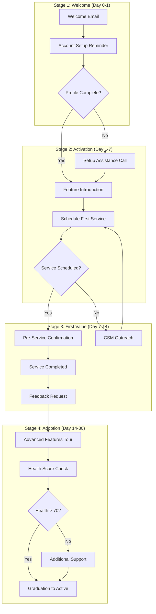

# Customer Onboarding Journey

> **Journey ID:** `journey_onboarding_v2`
> **Type:** Onboarding
> **Status:** Active
> **Owner:** Customer Success Team

---

## Journey Overview

### Objective Statement

> **Goal:** Transform new customers into successful, engaged users within 30 days of signup
>
> **Success Criteria:** 80% of customers complete onboarding and achieve first value milestone

### Target Audience

| Attribute            | Criteria                          |
| -------------------- | --------------------------------- |
| **Segment**          | New Customers                     |
| **Persona**          | Property Owner / Facility Manager |
| **Lifecycle Stage**  | New (0-30 days)                   |
| **Entry Conditions** | Customer created, contract signed |

### Key Metrics

| Metric                    | Target   | Description              |
| ------------------------- | -------- | ------------------------ |
| **Activation Rate**       | 80%      | Complete key setup steps |
| **Time to First Value**   | < 7 days | Schedule first service   |
| **Onboarding Completion** | 75%      | Finish all stages        |
| **Early Churn Rate**      | < 5%     | Cancel within 30 days    |

---

## Journey Map

### Visual Flow



---

## Stage 1: Welcome

### Overview

| Attribute         | Value                                                    |
| ----------------- | -------------------------------------------------------- |
| **Duration**      | Days 0-1                                                 |
| **Goal**          | Create positive first impression, initiate account setup |
| **Entry Trigger** | `customer.created` event                                 |
| **Exit Criteria** | Profile complete OR Day 2 reached                        |

### Emotional Map

| Aspect               | Description                                   |
| -------------------- | --------------------------------------------- |
| **Starting Emotion** | Excited but uncertain                         |
| **Target Emotion**   | Confident and supported                       |
| **Pain Points**      | Overwhelmed by new system, unclear next steps |
| **Gains**            | Clear guidance, personal welcome              |

### Steps

#### Step 1.1: Welcome Email

| Field       | Value                    |
| ----------- | ------------------------ |
| **Type**    | Email                    |
| **Channel** | Email                    |
| **Timing**  | Immediately after signup |
| **Owner**   | Automated                |

**Subject:** Welcome to Mac-Septic! Let's get you started

**Content:**

```
Hi {{customer.first_name}},

Welcome to the Mac-Septic family! We're thrilled to have you on board.

I'm {{csm.first_name}}, your dedicated Customer Success Manager. I'm here to ensure you get the most out of our services.

Here's what happens next:

1. **Complete Your Profile** (5 minutes)
   Set up your property details so we can serve you better.

2. **Schedule Your First Service**
   Book your first septic service at your convenience.

3. **Explore the Dashboard**
   See your service history, upcoming appointments, and more.

👉 **Get Started:** {{cta_button:Complete Setup:{{setup_url}}}}

Have questions? Reply to this email or call us at {{support_phone}}.

Welcome aboard!

{{csm.first_name}} {{csm.last_name}}
Customer Success Manager
```

**Personalization Variables:**

- `{{customer.first_name}}` - Customer's first name
- `{{csm.first_name}}` - Assigned CSM's name
- `{{setup_url}}` - Profile setup deep link
- `{{support_phone}}` - Support phone number

---

#### Step 1.2: Account Setup Reminder

| Field       | Value                                  |
| ----------- | -------------------------------------- |
| **Type**    | Email                                  |
| **Channel** | Email                                  |
| **Timing**  | Day 1, 9:00 AM (if profile incomplete) |
| **Owner**   | Automated                              |

**Condition:**

```yaml
if: customer.profile_complete == false
```

**Subject:** Quick reminder: Complete your Mac-Septic setup

**Content:**

```
Hi {{customer.first_name}},

Just a friendly reminder to complete your account setup. It only takes 5 minutes!

**Why complete your profile?**
✅ Get personalized service recommendations
✅ Receive timely maintenance reminders
✅ Access your complete service history

👉 **Complete Setup:** {{cta_button:Finish Profile:{{setup_url}}}}

Need help? Our team is standing by.

Best,
The Mac-Septic Team
```

---

#### Step 1.3: Decision Point - Profile Status

| Condition                                | Path                           |
| ---------------------------------------- | ------------------------------ |
| `profile_complete == true`               | Proceed to Stage 2: Activation |
| `profile_complete == false AND day >= 2` | Trigger CSM call, then Stage 2 |

---

## Stage 2: Activation

### Overview

| Attribute         | Value                                    |
| ----------------- | ---------------------------------------- |
| **Duration**      | Days 1-7                                 |
| **Goal**          | Guide customer to schedule first service |
| **Entry Trigger** | Profile complete OR Day 2                |
| **Exit Criteria** | First service scheduled                  |

### Emotional Map

| Aspect               | Description                                 |
| -------------------- | ------------------------------------------- |
| **Starting Emotion** | Curious, exploring                          |
| **Target Emotion**   | Empowered, in control                       |
| **Pain Points**      | Uncertain about services, pricing questions |
| **Gains**            | Understanding of value, service scheduled   |

### Steps

#### Step 2.0: Setup Assistance Call (Conditional)

| Field       | Value                       |
| ----------- | --------------------------- |
| **Type**    | Task                        |
| **Channel** | Phone                       |
| **Timing**  | Day 2 if profile incomplete |
| **Owner**   | CSM                         |

**Task Description:**

```
Call {{customer.name}} to assist with account setup.

Context:
- Signed up: {{customer.created_at}}
- Profile status: Incomplete
- Missing: {{customer.missing_fields}}

Goals:
1. Welcome and build rapport
2. Help complete profile
3. Answer any questions
4. Encourage first service booking

Log outcome in CRM.
```

---

#### Step 2.1: Feature Introduction

| Field       | Value           |
| ----------- | --------------- |
| **Type**    | Email           |
| **Channel** | Email           |
| **Timing**  | Day 2, 10:00 AM |
| **Owner**   | Automated       |

**Subject:** 3 ways Mac-Septic makes your life easier

**Content:**

```
Hi {{customer.first_name}},

Now that you're set up, here are three powerful features at your fingertips:

**1. Smart Scheduling**
Book services online 24/7. We'll send reminders so you never miss maintenance.

**2. Service History**
Access your complete service records anytime. Great for property records and inspections.

**3. Proactive Alerts**
We monitor your system and alert you before problems become emergencies.

Ready to experience the difference?

👉 **Schedule Service:** {{cta_button:Book Now:{{booking_url}}}}

Questions? Just reply to this email.

Cheers,
{{csm.first_name}}
```

---

#### Step 2.2: Schedule First Service Reminder

| Field       | Value                         |
| ----------- | ----------------------------- |
| **Type**    | SMS                           |
| **Channel** | SMS                           |
| **Timing**  | Day 4 if no service scheduled |
| **Owner**   | Automated                     |

**Condition:**

```yaml
if:
  - customer.services_scheduled == 0
  - customer.sms_opted_in == true
```

**Content:**

```
Hi {{customer.first_name}}! Your Mac-Septic account is ready. Schedule your first service and get 10% off: {{short_link}} - Reply STOP to opt out
```

---

#### Step 2.3: CSM Outreach (Conditional)

| Field       | Value                         |
| ----------- | ----------------------------- |
| **Type**    | Task                          |
| **Channel** | Phone/Email                   |
| **Timing**  | Day 6 if no service scheduled |
| **Owner**   | CSM                           |

**Condition:**

```yaml
if: customer.services_scheduled == 0
```

**Task Description:**

```
PRIORITY: High-touch outreach needed

Customer {{customer.name}} hasn't scheduled first service.

Account age: 6 days
Last activity: {{customer.last_activity}}
Email opens: {{email_metrics.opens}}

Recommended approach:
1. Personal phone call
2. If no answer, send personalized email
3. Offer scheduling assistance
4. Address any concerns

Success = Service scheduled
```

---

#### Step 2.4: Decision Point - Service Status

| Condition                              | Path                                                   |
| -------------------------------------- | ------------------------------------------------------ |
| `services_scheduled > 0`               | Proceed to Stage 3: First Value                        |
| `day >= 7 AND services_scheduled == 0` | Flag as at-risk, continue to Stage 3 with intervention |

---

## Stage 3: First Value

### Overview

| Attribute         | Value                                         |
| ----------------- | --------------------------------------------- |
| **Duration**      | Days 7-14                                     |
| **Goal**          | Deliver exceptional first service experience  |
| **Entry Trigger** | Service scheduled OR Day 7                    |
| **Exit Criteria** | First service completed and feedback received |

### Emotional Map

| Aspect               | Description                       |
| -------------------- | --------------------------------- |
| **Starting Emotion** | Anticipation, slight anxiety      |
| **Target Emotion**   | Satisfied, validated their choice |
| **Pain Points**      | Uncertainty about service quality |
| **Gains**            | Problem solved, trust established |

### Steps

#### Step 3.1: Pre-Service Confirmation

| Field       | Value                             |
| ----------- | --------------------------------- |
| **Type**    | Email + SMS                       |
| **Channel** | Multi-channel                     |
| **Timing**  | 24 hours before scheduled service |
| **Owner**   | Automated                         |

**Email Subject:** Your service tomorrow - What to expect

**Email Content:**

```
Hi {{customer.first_name}},

Your septic service is scheduled for tomorrow!

**Appointment Details:**
📅 Date: {{service.date}}
⏰ Time: {{service.time_window}}
📍 Location: {{customer.service_address}}
🔧 Service: {{service.type}}

**Your Technician:**
{{technician.name}} will be servicing your property. They have {{technician.years_experience}} years of experience and a {{technician.rating}}⭐ rating.

**What to expect:**
1. Technician arrives in marked vehicle
2. Brief property assessment
3. Service performed ({{service.estimated_duration}})
4. Summary report provided

**Need to reschedule?**
{{cta_button:Reschedule:{{reschedule_url}}}}

See you tomorrow!
The Mac-Septic Team
```

**SMS (same day, 2 hours before):**

```
Reminder: Mac-Septic service today {{service.time_window}}. {{technician.first_name}} is on the way! Track: {{tracking_link}}
```

---

#### Step 3.2: Service Completion Follow-up

| Field       | Value                                 |
| ----------- | ------------------------------------- |
| **Type**    | Email                                 |
| **Channel** | Email                                 |
| **Timing**  | 2 hours after service marked complete |
| **Owner**   | Automated                             |

**Subject:** How did we do? Your service is complete

**Content:**

```
Hi {{customer.first_name}},

Your service has been completed! Here's your summary:

**Service Report**
📋 Service: {{service.type}}
✅ Status: Complete
👤 Technician: {{technician.name}}
📝 Notes: {{service.notes}}

**Your feedback matters!**
Help us maintain our high standards by sharing your experience.

⭐⭐⭐⭐⭐
{{cta_button:Rate Your Service:{{feedback_url}}}}

**Next Steps:**
Based on your service, we recommend your next maintenance in {{next_service.recommended_date}}.

👉 **Schedule Next Service:** {{cta_button:Book Now:{{booking_url}}}}

Thank you for choosing Mac-Septic!

{{csm.first_name}}
```

---

#### Step 3.3: NPS Survey

| Field       | Value                                       |
| ----------- | ------------------------------------------- |
| **Type**    | In-App + Email                              |
| **Channel** | Multi-channel                               |
| **Timing**  | Day 10 (3 days after typical first service) |
| **Owner**   | Automated                                   |

**Subject:** One quick question about your Mac-Septic experience

**Content:**

```
Hi {{customer.first_name}},

On a scale of 0-10, how likely are you to recommend Mac-Septic to a friend or colleague?

{{nps_scale}}

Your feedback helps us improve!

Thanks,
{{csm.first_name}}
```

---

## Stage 4: Adoption

### Overview

| Attribute         | Value                                              |
| ----------------- | -------------------------------------------------- |
| **Duration**      | Days 14-30                                         |
| **Goal**          | Establish usage patterns, ensure health score > 70 |
| **Entry Trigger** | First service completed                            |
| **Exit Criteria** | Health score > 70 AND Day 30 reached               |

### Emotional Map

| Aspect               | Description                         |
| -------------------- | ----------------------------------- |
| **Starting Emotion** | Satisfied, open to more             |
| **Target Emotion**   | Loyal, confident advocate           |
| **Pain Points**      | Not utilizing all features          |
| **Gains**            | Full platform adoption, clear value |

### Steps

#### Step 4.1: Advanced Features Introduction

| Field       | Value     |
| ----------- | --------- |
| **Type**    | Email     |
| **Channel** | Email     |
| **Timing**  | Day 14    |
| **Owner**   | Automated |

**Subject:** Unlock the full power of your Mac-Septic account

**Content:**

```
Hi {{customer.first_name}},

You've completed your first service - great start! Here are some features to explore next:

**📱 Mobile App**
Manage everything from your phone. Download for {{app_links}}.

**🔔 Smart Alerts**
Set up notifications for maintenance reminders and system health alerts.

**📊 Service Dashboard**
Track your service history, upcoming appointments, and property health.

**📄 Document Storage**
Store inspection reports, permits, and service records in one place.

{{cta_button:Explore Features:{{dashboard_url}}}}

Questions about any features? Just ask!

{{csm.first_name}}
```

---

#### Step 4.2: Health Score Check

| Field       | Value          |
| ----------- | -------------- |
| **Type**    | Internal Check |
| **Channel** | System         |
| **Timing**  | Day 21         |
| **Owner**   | Automated      |

**Logic:**

```yaml
evaluate:
  - customer.health_score

if health_score >= 70:
  action: proceed_to_graduation

if health_score < 70:
  action: trigger_additional_support
  create_task:
    type: csm_intervention
    priority: high
    message: "Customer {{customer.name}} health score {{health_score}} - needs attention"
```

---

#### Step 4.3: Additional Support (Conditional)

| Field       | Value                 |
| ----------- | --------------------- |
| **Type**    | Task + Email          |
| **Channel** | Phone + Email         |
| **Timing**  | Day 21 if health < 70 |
| **Owner**   | CSM                   |

**Task:**

```
INTERVENTION REQUIRED

Customer: {{customer.name}}
Health Score: {{customer.health_score}}
Risk Factors: {{customer.risk_factors}}

Action Required:
1. Review account activity
2. Identify engagement gaps
3. Personal outreach call
4. Create improvement plan

Target: Health score > 70 by Day 30
```

---

#### Step 4.4: Graduation Email

| Field       | Value                    |
| ----------- | ------------------------ |
| **Type**    | Email                    |
| **Channel** | Email                    |
| **Timing**  | Day 30 (if health >= 70) |
| **Owner**   | Automated                |

**Subject:** Congratulations! You're officially a Mac-Septic pro 🎉

**Content:**

```
Hi {{customer.first_name}},

Wow - 30 days already! You've officially completed onboarding, and you're rocking it:

**Your Stats:**
✅ Profile: Complete
📅 Services: {{customer.services_completed}} completed
⭐ Health Score: {{customer.health_score}}/100
📈 Status: Active Customer

**What's Next?**
You'll now receive:
- Quarterly business reviews
- Priority support access
- Exclusive customer offers
- Referral program access

**Speaking of referrals...**
Know someone who could use our services? You both get $50!

{{cta_button:Refer a Friend:{{referral_url}}}}

Thank you for choosing Mac-Septic. Here's to many years of worry-free service!

{{csm.first_name}}
Customer Success Manager

P.S. Have feedback about your onboarding experience? Reply to this email - I read every response!
```

---

## Automation Rules

### Triggers Summary

| Trigger       | Condition                       | Action                            |
| ------------- | ------------------------------- | --------------------------------- |
| Journey Entry | `customer.created`              | Enroll, send welcome email        |
| Stage 2 Entry | `profile_complete OR day >= 2`  | Begin activation sequence         |
| Stage 3 Entry | `service.scheduled OR day >= 7` | Begin first value sequence        |
| Stage 4 Entry | `service.completed`             | Begin adoption sequence           |
| Journey Exit  | `day >= 30 AND health >= 70`    | Graduate, start retention journey |

### Exit Conditions

| Exit Type    | Condition                          | Action                              |
| ------------ | ---------------------------------- | ----------------------------------- |
| Success      | Completed Day 30 with health >= 70 | Graduate to active customer         |
| At-Risk Exit | Health < 50 at Day 30              | Enroll in risk mitigation journey   |
| Early Churn  | Customer cancelled                 | Log, trigger win-back after 30 days |
| Manual Exit  | CSM intervention                   | Log reason, handle case-by-case     |

---

## Testing Checklist

### Pre-Launch

- [x] All email templates reviewed and approved
- [x] Personalization variables tested
- [x] Trigger conditions validated
- [x] SMS opt-in logic verified
- [x] CSM task creation working
- [x] Health score calculation confirmed

### Week 1 Monitoring

- [ ] Entry rate within expected range
- [ ] Email delivery > 98%
- [ ] Open rates > 40%
- [ ] No customer complaints
- [ ] CSM tasks creating properly

---

## Change Log

| Date     | Version | Author  | Changes                                    |
| -------- | ------- | ------- | ------------------------------------------ |
| Jan 2026 | 2.0     | CS Team | Complete redesign with 2026 best practices |
| Dec 2025 | 1.5     | CS Team | Added SMS touchpoints                      |
| Oct 2025 | 1.0     | CS Team | Initial launch                             |

---

**Journey Owner:** Customer Success Team
**Last Review:** January 2026
**Next Review:** April 2026
