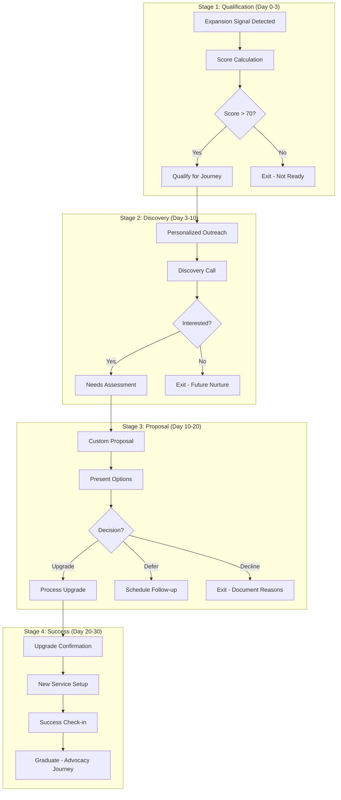

# Service Upgrade Journey

> **Journey ID:** `journey_service_upgrade_v2`
> **Type:** Expansion
> **Status:** Active
> **Owner:** Customer Success Team

---

## Journey Overview

### Objective Statement

> **Goal:** Identify customers ready for service expansion and guide them through a value-driven upgrade process
>
> **Success Criteria:** 25% conversion rate from qualified leads to upgraded services; 90% satisfaction among upgraded customers

### Target Audience

| Attribute            | Criteria                                                |
| -------------------- | ------------------------------------------------------- |
| **Segment**          | Expansion-Ready Customers                               |
| **Persona**          | Property owners showing growth signals                  |
| **Lifecycle Stage**  | Mature (6+ months tenure)                               |
| **Entry Conditions** | Expansion score > 70 OR usage > 80% OR customer request |

### Expansion Signals

| Signal                         | Weight | Description                     |
| ------------------------------ | ------ | ------------------------------- |
| **High Usage**                 | High   | Service usage > 80% of plan     |
| **Additional Properties**      | High   | Customer acquired new property  |
| **Service Frequency Increase** | Medium | Requested more frequent service |
| **Feature Requests**           | Medium | Asked about premium features    |
| **Positive NPS**               | Medium | NPS 9-10 (Promoter)             |
| **Contract Renewal**           | Low    | Approaching renewal window      |

---

## Journey Map

### Visual Flow



---

## Stage 1: Qualification

### Overview

| Attribute         | Value                                                |
| ----------------- | ---------------------------------------------------- |
| **Duration**      | Days 0-3                                             |
| **Goal**          | Validate expansion readiness and qualify opportunity |
| **Entry Trigger** | Expansion signal detected                            |
| **Exit Criteria** | Qualified (score > 70) or disqualified               |

### Expansion Score Calculation

```typescript
interface ExpansionScore {
  customer_id: string;
  score: number; // 0-100
  factors: ExpansionFactor[];
  recommendation: "pursue" | "nurture" | "wait";
}

function calculateExpansionScore(customer: Customer): ExpansionScore {
  let score = 0;
  const factors: ExpansionFactor[] = [];

  // Usage factor (0-25 points)
  const usagePercent = customer.usage / customer.plan_limit;
  if (usagePercent > 0.9) {
    score += 25;
    factors.push({
      name: "High Usage",
      score: 25,
      detail: `${usagePercent * 100}% of plan`,
    });
  } else if (usagePercent > 0.7) {
    score += 15;
    factors.push({
      name: "Growing Usage",
      score: 15,
      detail: `${usagePercent * 100}% of plan`,
    });
  }

  // Engagement factor (0-25 points)
  if (customer.health_score > 80) {
    score += 25;
    factors.push({
      name: "Excellent Health",
      score: 25,
      detail: `Health: ${customer.health_score}`,
    });
  } else if (customer.health_score > 60) {
    score += 15;
    factors.push({
      name: "Good Health",
      score: 15,
      detail: `Health: ${customer.health_score}`,
    });
  }

  // Tenure factor (0-15 points)
  if (customer.tenure_months > 12) {
    score += 15;
    factors.push({
      name: "Loyal Customer",
      score: 15,
      detail: `${customer.tenure_months} months`,
    });
  } else if (customer.tenure_months > 6) {
    score += 10;
    factors.push({
      name: "Established Customer",
      score: 10,
      detail: `${customer.tenure_months} months`,
    });
  }

  // NPS factor (0-20 points)
  if (customer.nps_score >= 9) {
    score += 20;
    factors.push({
      name: "Promoter",
      score: 20,
      detail: `NPS: ${customer.nps_score}`,
    });
  } else if (customer.nps_score >= 7) {
    score += 10;
    factors.push({
      name: "Passive",
      score: 10,
      detail: `NPS: ${customer.nps_score}`,
    });
  }

  // Growth signals (0-15 points)
  if (customer.new_properties_added) {
    score += 15;
    factors.push({
      name: "New Properties",
      score: 15,
      detail: "Recently added properties",
    });
  }

  const recommendation =
    score >= 70 ? "pursue" : score >= 50 ? "nurture" : "wait";

  return { customer_id: customer.id, score, factors, recommendation };
}
```

### Steps

#### Step 1.1: Signal Detection

| Field       | Value                |
| ----------- | -------------------- |
| **Type**    | System Event         |
| **Channel** | Internal             |
| **Timing**  | Real-time monitoring |
| **Owner**   | Automated            |

**Detection Rules:**

```yaml
triggers:
  - event: "usage.threshold_reached"
    condition: "current_usage >= plan_limit * 0.8"
    action: "calculate_expansion_score"

  - event: "property.added"
    condition: "new property linked to account"
    action: "calculate_expansion_score"

  - event: "service.frequency_increased"
    condition: "requested frequency > current frequency"
    action: "calculate_expansion_score"

  - event: "nps.submitted"
    condition: "nps_score >= 9"
    action: "calculate_expansion_score"
```

---

#### Step 1.2: Opportunity Record Creation

| Field       | Value            |
| ----------- | ---------------- |
| **Type**    | System Action    |
| **Channel** | CRM              |
| **Timing**  | On qualification |
| **Owner**   | Automated        |

**Opportunity Data:**

```yaml
opportunity:
  customer_id: "{{customer.id}}"
  type: "expansion"
  source: "automated_qualification"
  expansion_score: "{{score}}"
  qualification_factors: "{{factors}}"
  estimated_value: "{{calculated_value}}"
  assigned_to: "{{customer.csm_id}}"
  stage: "qualified"
  created_at: "{{timestamp}}"
```

---

## Stage 2: Discovery

### Overview

| Attribute         | Value                                          |
| ----------------- | ---------------------------------------------- |
| **Duration**      | Days 3-10                                      |
| **Goal**          | Understand specific needs and confirm interest |
| **Entry Trigger** | Qualification score > 70                       |
| **Exit Criteria** | Customer interested and needs documented       |

### Emotional Map

| Aspect               | Description                            |
| -------------------- | -------------------------------------- |
| **Starting Emotion** | Content with current service           |
| **Target Emotion**   | Excited about growth possibilities     |
| **Pain Points**      | Concern about costs, change management |
| **Gains**            | Efficiency, coverage, peace of mind    |

### Steps

#### Step 2.1: Personalized Outreach Email

| Field       | Value                    |
| ----------- | ------------------------ |
| **Type**    | Email                    |
| **Channel** | Email                    |
| **Timing**  | Day 3, optimal send time |
| **Owner**   | CSM (automated send)     |

**Subject:** {{customer.first_name}}, I noticed something exciting about your account

**Content:**

```
Hi {{customer.first_name}},

I've been reviewing your account and noticed some exciting growth indicators:

{{#if high_usage}}
📈 **Usage Growing:** You're using {{usage_percent}}% of your current plan - fantastic engagement!
{{/if}}

{{#if new_properties}}
🏠 **Expanding Properties:** Congratulations on your new property at {{new_property_address}}!
{{/if}}

{{#if promoter_nps}}
⭐ **Happy Customer:** Your recent feedback made our day!
{{/if}}

This got me thinking about how we might better serve your growing needs.

I'd love to schedule a quick 15-minute call to:
- Learn more about your growth plans
- Explore options that could save you time and money
- Ensure your service matches your evolving needs

**No sales pitch, just a conversation.**

{{cta_button:Schedule 15 Minutes:{{calendar_link}}}}

Or reply with a good time to chat.

Best,
{{csm.first_name}}

P.S. Even if you're happy with things as they are, I'd love to hear what's working well!
```

---

#### Step 2.2: Follow-Up (If No Response)

| Field       | Value                             |
| ----------- | --------------------------------- |
| **Type**    | Email                             |
| **Channel** | Email                             |
| **Timing**  | Day 6 (if no response or booking) |
| **Owner**   | Automated                         |

**Subject:** Re: Quick question about your Mac-Septic service

**Content:**

```
Hi {{customer.first_name}},

Just bubbling this up in case it got lost in the shuffle.

I'm genuinely curious about your experience and growth plans - no obligations attached.

Would any of these times work for a quick chat?
{{available_slots}}

Or simply reply with what's on your mind - I read every email.

{{csm.first_name}}
```

---

#### Step 2.3: Discovery Call Task

| Field       | Value                  |
| ----------- | ---------------------- |
| **Type**    | Task                   |
| **Channel** | Phone/Video            |
| **Timing**  | When meeting scheduled |
| **Owner**   | CSM                    |

**Call Preparation:**

```
DISCOVERY CALL PREP

Customer: {{customer.name}}
Expansion Score: {{expansion_score}}
Current Services: {{current_services}}
Tenure: {{tenure_months}} months
ARR: {{customer.arr}}

KEY QUESTIONS TO ASK:

1. Business Growth
   - "How has your property portfolio changed recently?"
   - "What are your plans for the next 12 months?"

2. Current Experience
   - "What's working well with your current service?"
   - "If you could change one thing, what would it be?"

3. Needs Assessment
   - "Are there any service gaps you've encountered?"
   - "How do you handle [specific scenario]?"

4. Decision Process
   - "Who else would be involved in service decisions?"
   - "What would make this a worthwhile upgrade for you?"

EXPANSION OPPORTUNITIES TO EXPLORE:
{{#each expansion_options}}
  - {{this.name}}: {{this.description}}
{{/each}}

Remember: Listen more than you talk. This is discovery, not selling.
```

---

#### Step 2.4: Post-Call Documentation

| Field       | Value                   |
| ----------- | ----------------------- |
| **Type**    | Task                    |
| **Channel** | CRM                     |
| **Timing**  | Within 24 hours of call |
| **Owner**   | CSM                     |

**Documentation Template:**

```
DISCOVERY CALL SUMMARY

Date: {{call_date}}
Duration: {{call_duration}}
Attendees: {{attendees}}

CUSTOMER SITUATION:
[Summary of current state and challenges]

GROWTH PLANS:
[Customer's expressed plans and timeline]

IDENTIFIED NEEDS:
- Need 1: [description] - Priority: [High/Medium/Low]
- Need 2: [description] - Priority: [High/Medium/Low]

OBJECTIONS/CONCERNS:
[Any hesitations expressed]

DECISION MAKERS:
[Who needs to be involved]

TIMELINE:
[Customer's decision timeline]

NEXT STEPS:
1. [Action] - Owner: [name] - Due: [date]
2. [Action] - Owner: [name] - Due: [date]

OPPORTUNITY STATUS: [Interested / Needs More Info / Not Now]
PROBABILITY: [%]
```

---

## Stage 3: Proposal

### Overview

| Attribute         | Value                                           |
| ----------------- | ----------------------------------------------- |
| **Duration**      | Days 10-20                                      |
| **Goal**          | Present tailored solution and secure commitment |
| **Entry Trigger** | Customer confirmed interested                   |
| **Exit Criteria** | Decision made (upgrade, defer, or decline)      |

### Steps

#### Step 3.1: Custom Proposal Creation

| Field       | Value                             |
| ----------- | --------------------------------- |
| **Type**    | Task                              |
| **Channel** | Internal                          |
| **Timing**  | Within 48 hours of discovery call |
| **Owner**   | CSM                               |

**Proposal Framework:**

```
PROPOSAL: {{customer.name}}
Date: {{date}}
Prepared by: {{csm.name}}

─────────────────────────────────────────

EXECUTIVE SUMMARY

Based on our conversation, I've put together a recommendation
that addresses your specific needs for [key need summary].

─────────────────────────────────────────

CURRENT STATE

Services: {{current_services}}
Monthly Investment: {{current_monthly}}
Coverage: {{current_coverage}}

─────────────────────────────────────────

RECOMMENDED SOLUTION

Option A: [Primary Recommendation]
━━━━━━━━━━━━━━━━━━━━━━━━━━━━━━━━━━━━━━━━
Services Included:
{{#each option_a_services}}
  ✓ {{this.name}}
{{/each}}

Investment: {{option_a_price}}/month
Value: {{option_a_value_proposition}}

Option B: [Alternative]
━━━━━━━━━━━━━━━━━━━━━━━━━━━━━━━━━━━━━━━━
Services Included:
{{#each option_b_services}}
  ✓ {{this.name}}
{{/each}}

Investment: {{option_b_price}}/month
Value: {{option_b_value_proposition}}

─────────────────────────────────────────

ROI ANALYSIS

Annual savings/value: {{annual_value}}
- Time saved: {{time_saved}} hours/year
- Issue prevention: {{issues_prevented}}
- Convenience value: {{convenience_value}}

Payback period: {{payback_period}}

─────────────────────────────────────────

IMPLEMENTATION

Timeline: {{implementation_timeline}}
Steps:
1. Contract signing
2. Service configuration (1-2 days)
3. First enhanced service (within 1 week)
4. Success check-in (30 days)

─────────────────────────────────────────

NEXT STEPS

Let's schedule a brief call to discuss these options
and answer any questions.

{{cta_button:Schedule Call:{{calendar_link}}}}
```

---

#### Step 3.2: Proposal Delivery

| Field       | Value               |
| ----------- | ------------------- |
| **Type**    | Email               |
| **Channel** | Email               |
| **Timing**  | When proposal ready |
| **Owner**   | CSM                 |

**Subject:** Your personalized Mac-Septic upgrade options

**Content:**

```
Hi {{customer.first_name}},

As promised, I've put together some options based on our conversation about {{key_need}}.

**Quick Summary:**

| Option | What You Get | Investment |
|--------|--------------|------------|
| {{option_a_name}} | {{option_a_summary}} | {{option_a_price}}/mo |
| {{option_b_name}} | {{option_b_summary}} | {{option_b_price}}/mo |

I've attached the full proposal with ROI analysis and implementation details.

**My recommendation:** {{recommended_option}} because {{recommendation_reason}}.

Want to walk through this together? I'm available:
{{available_slots}}

Or feel free to reply with any questions.

Best,
{{csm.first_name}}

[Attachment: {{proposal_pdf}}]
```

---

#### Step 3.3: Decision Follow-Up

| Field       | Value                       |
| ----------- | --------------------------- |
| **Type**    | Multi-step sequence         |
| **Channel** | Email + Phone               |
| **Timing**  | Day 3, 7, 10 after proposal |
| **Owner**   | CSM                         |

**Day 3 Email:**

```
Subject: Any questions on the proposal?

Hi {{customer.first_name}},

Just checking in - had a chance to review the upgrade options?

Happy to clarify anything or adjust the proposal based on your feedback.

{{csm.first_name}}
```

**Day 7 Phone Call Task:**

```
Call {{customer.name}} to discuss proposal status.

Goals:
1. Address any questions or concerns
2. Understand where they are in decision process
3. Identify any blockers
4. Clarify timeline

If voicemail:
"Hi {{customer.first_name}}, it's {{csm.first_name}} from Mac-Septic.
Just following up on the proposal I sent. Give me a call when you
have a moment - I'm at {{csm.phone}}. Talk soon!"
```

**Day 10 Email (if no response):**

```
Subject: Should I close this out?

Hi {{customer.first_name}},

I want to respect your time, so I'll keep this brief.

Are you still interested in exploring the service upgrade?

- **Yes** - Let's schedule time to finalize: {{calendar_link}}
- **Not right now** - No problem! When should I check back?
- **Changed mind** - Totally understand. Any feedback for us?

Just reply with what makes sense for you.

Thanks,
{{csm.first_name}}
```

---

#### Step 3.4: Decision Handling

**If Upgrade:**

```yaml
on_upgrade:
  actions:
    - create_order: "{{selected_option}}"
    - update_opportunity: "won"
    - send_confirmation: true
    - schedule_implementation: true
    - notify_operations: true
    - celebrate: true # Slack notification to team
```

**If Defer:**

```yaml
on_defer:
  actions:
    - update_opportunity: "deferred"
    - set_follow_up_date: "{{customer_provided_date}}"
    - add_to_nurture_segment: true
    - document_reason: "{{defer_reason}}"
```

**If Decline:**

```yaml
on_decline:
  actions:
    - update_opportunity: "lost"
    - document_reason: "{{decline_reason}}"
    - send_graceful_exit_email: true
    - schedule_future_review: "+6 months"
```

---

## Stage 4: Success

### Overview

| Attribute         | Value                                             |
| ----------------- | ------------------------------------------------- |
| **Duration**      | Days 20-30                                        |
| **Goal**          | Ensure smooth upgrade experience and satisfaction |
| **Entry Trigger** | Upgrade order confirmed                           |
| **Exit Criteria** | Customer satisfied with upgraded service          |

### Steps

#### Step 4.1: Upgrade Confirmation

| Field       | Value                     |
| ----------- | ------------------------- |
| **Type**    | Email                     |
| **Channel** | Email                     |
| **Timing**  | Immediately after upgrade |
| **Owner**   | Automated                 |

**Subject:** Welcome to {{new_plan_name}}! Here's what happens next

**Content:**

```
Hi {{customer.first_name}},

Congratulations on upgrading to {{new_plan_name}}! 🎉

Here's a quick overview of what's changing:

**Your New Benefits:**
{{#each new_benefits}}
✅ {{this}}
{{/each}}

**What Happens Next:**
1. **Today:** Your account is updated
2. **Within 48 hours:** You'll receive a welcome call from our team
3. **Within 7 days:** Your first enhanced service
4. **Day 30:** Success check-in with me

**Your New Monthly Investment:** {{new_monthly_price}}
**Effective Date:** {{effective_date}}

Questions before we get started? Just reply here or call {{support_phone}}.

Excited for this next chapter!

{{csm.first_name}}
```

---

#### Step 4.2: Implementation Kick-Off Call

| Field       | Value                      |
| ----------- | -------------------------- |
| **Type**    | Task                       |
| **Channel** | Phone                      |
| **Timing**  | Within 48 hours of upgrade |
| **Owner**   | CSM or Operations          |

**Call Agenda:**

```
UPGRADE IMPLEMENTATION CALL

Customer: {{customer.name}}
New Plan: {{new_plan_name}}
Previous Plan: {{old_plan_name}}

CALL OBJECTIVES:
1. Welcome and thank them for the upgrade
2. Confirm service details and schedule
3. Set expectations for enhanced services
4. Answer any questions
5. Confirm success check-in date

KEY POINTS TO COVER:
- New service features and how to access them
- Updated scheduling (if applicable)
- New contact points (if applicable)
- How to provide feedback

DOCUMENT:
- Any special requests
- Concerns to monitor
- Success metrics they care about
```

---

#### Step 4.3: First Enhanced Service Follow-Up

| Field       | Value                                 |
| ----------- | ------------------------------------- |
| **Type**    | Email                                 |
| **Channel** | Email                                 |
| **Timing**  | 24 hours after first enhanced service |
| **Owner**   | Automated                             |

**Subject:** How was your first {{new_plan_name}} experience?

**Content:**

```
Hi {{customer.first_name}},

You just completed your first service under {{new_plan_name}}!

**Service Details:**
- Date: {{service_date}}
- Type: {{service_type}}
- Technician: {{technician_name}}
- Notes: {{service_notes}}

**Quick Question:**
Did the service meet your expectations?

{{cta_button:Yes, great!:{{feedback_positive}}}}
{{cta_button:Could be better:{{feedback_negative}}}}

Your feedback helps us ensure we're delivering on our promise.

{{csm.first_name}}
```

---

#### Step 4.4: 30-Day Success Check-In

| Field       | Value                |
| ----------- | -------------------- |
| **Type**    | Call + Email         |
| **Channel** | Phone + Email        |
| **Timing**  | Day 30 after upgrade |
| **Owner**   | CSM                  |

**Pre-Call Email:**

```
Subject: 30-day check-in - How's {{new_plan_name}} working for you?

Hi {{customer.first_name}},

It's been 30 days since you upgraded to {{new_plan_name}}, and I wanted
to personally check in on how things are going.

Before our call, here's a quick snapshot:

**Your Upgrade Stats:**
- Services completed: {{services_count}}
- New features used: {{features_used}}
- Estimated value delivered: {{value_delivered}}

I'll call you at {{scheduled_time}} to hear your thoughts.

Talk soon!
{{csm.first_name}}
```

**Call Guide:**

```
30-DAY SUCCESS CHECK-IN

QUESTIONS:
1. "How has the upgrade been working for you so far?"
2. "Are you seeing the value you expected?"
3. "What's been the biggest benefit?"
4. "Anything we could do better?"
5. "Would you recommend this upgrade to others in your situation?"

SUCCESS INDICATORS:
- Customer expresses satisfaction
- Using new features/services
- Seeing expected value
- No major complaints

IF ISSUES:
- Document concerns
- Create action items
- Schedule follow-up
- Consider remediation

CLOSE:
- Thank them for the feedback
- Remind them of your availability
- Mention referral program if appropriate
```

---

#### Step 4.5: Graduation to Advocacy

| Field       | Value                         |
| ----------- | ----------------------------- |
| **Type**    | Decision + Action             |
| **Channel** | System                        |
| **Timing**  | After successful 30-day check |
| **Owner**   | Automated                     |

**Logic:**

```yaml
graduation_check:
  criteria:
    - satisfaction_confirmed: true
    - services_completed: ">= 1"
    - no_open_issues: true

  on_success:
    - exit_journey: "success"
    - update_customer: "expansion_success"
    - consider_advocacy_journey: true
    - send_success_email: true
    - update_metrics: true

success_email:
  subject: "You're all set with {{new_plan_name}}!"
  content: |
    Hi {{customer.first_name}},

    Your {{new_plan_name}} upgrade is complete and running smoothly!

    Thank you for growing with Mac-Septic. We're committed to
    continuing to deliver exceptional service.

    Know someone who could benefit from our services?
    Refer them and you both get {{referral_reward}}!

    {{cta_button:Refer a Friend:{{referral_link}}}}

    Here's to a great partnership!
    {{csm.first_name}}
```

---

## Metrics & Reporting

### Journey KPIs

| Metric                   | Target | Description                          |
| ------------------------ | ------ | ------------------------------------ |
| **Qualification Rate**   | 30%    | Signals → Qualified opportunities    |
| **Discovery Completion** | 70%    | Qualified → Discovery call completed |
| **Proposal Rate**        | 60%    | Discovery → Proposal sent            |
| **Win Rate**             | 40%    | Proposals → Upgrades                 |
| **Overall Conversion**   | 25%    | Signals → Upgrades                   |
| **Upgrade Satisfaction** | 90%    | Happy at 30-day check-in             |

### Revenue Impact

```yaml
metrics:
  - name: "Pipeline Value"
    calculation: "SUM(opportunity.estimated_value WHERE stage != closed)"

  - name: "Expansion Revenue"
    calculation: "SUM(upgrade.additional_arr WHERE closed_date in period)"

  - name: "Average Deal Size"
    calculation: "AVG(upgrade.additional_arr)"

  - name: "Sales Cycle"
    calculation: "AVG(upgrade.days_to_close)"
```

---

## Change Log

| Date     | Version | Author  | Changes                                  |
| -------- | ------- | ------- | ---------------------------------------- |
| Jan 2026 | 2.0     | CS Team | Added AI scoring, new proposal framework |
| Oct 2025 | 1.5     | CS Team | Improved discovery questions             |
| Aug 2025 | 1.0     | CS Team | Initial journey launch                   |

---

**Journey Owner:** Customer Success Team
**Last Review:** January 2026
**Next Review:** April 2026
